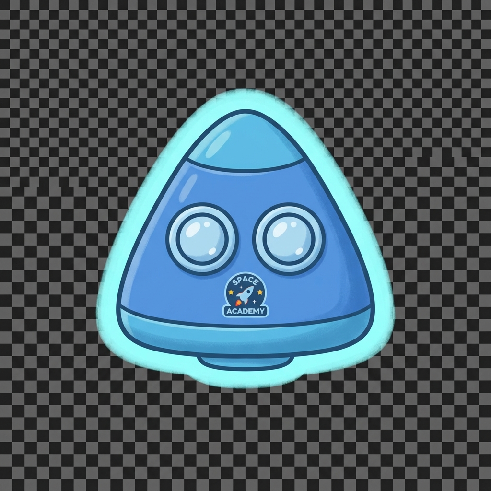
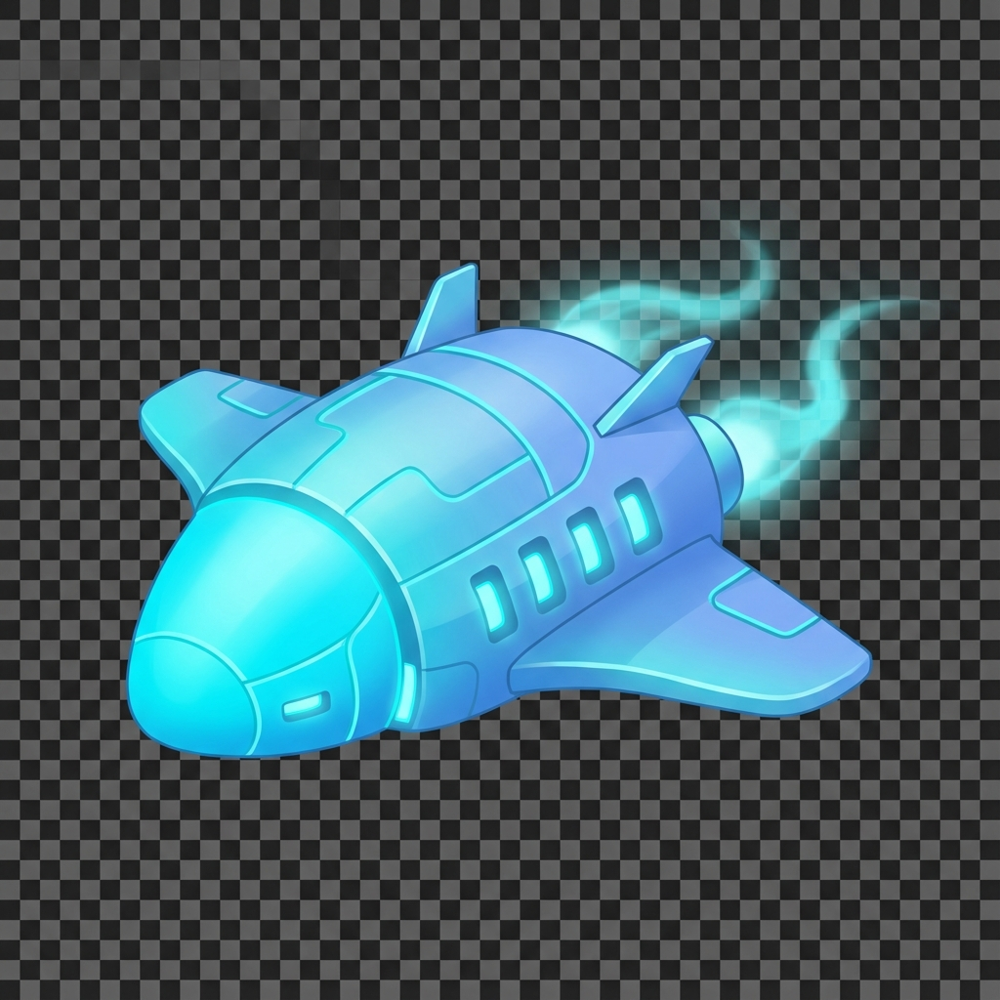
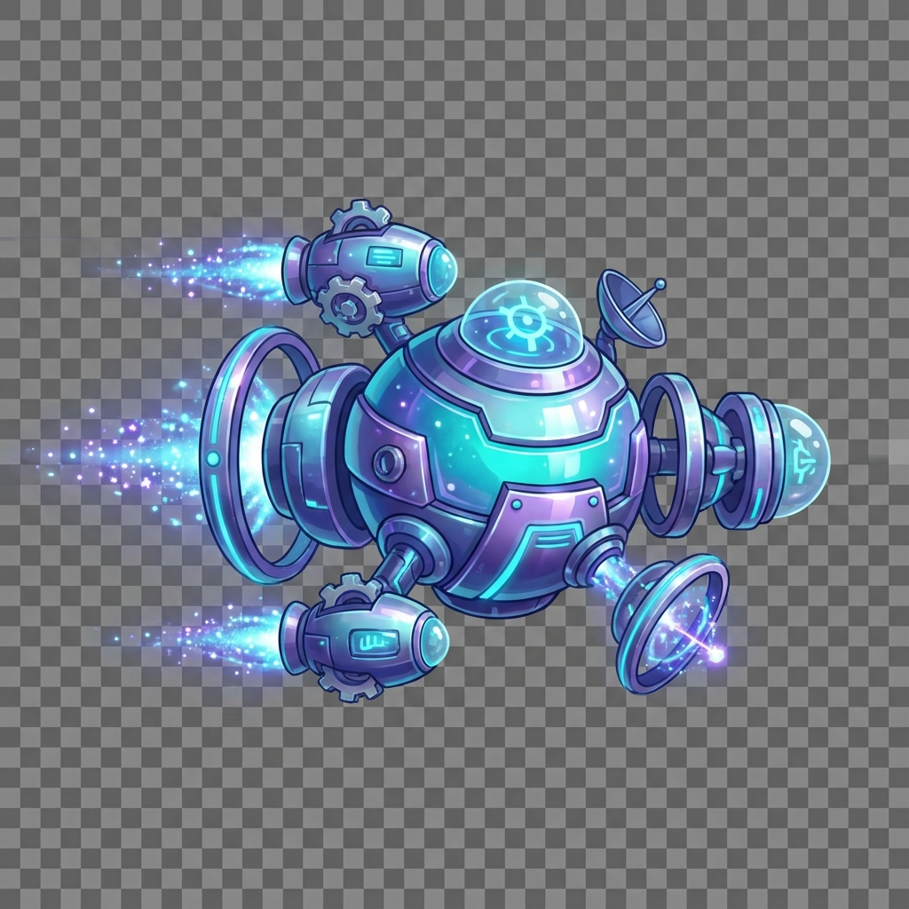
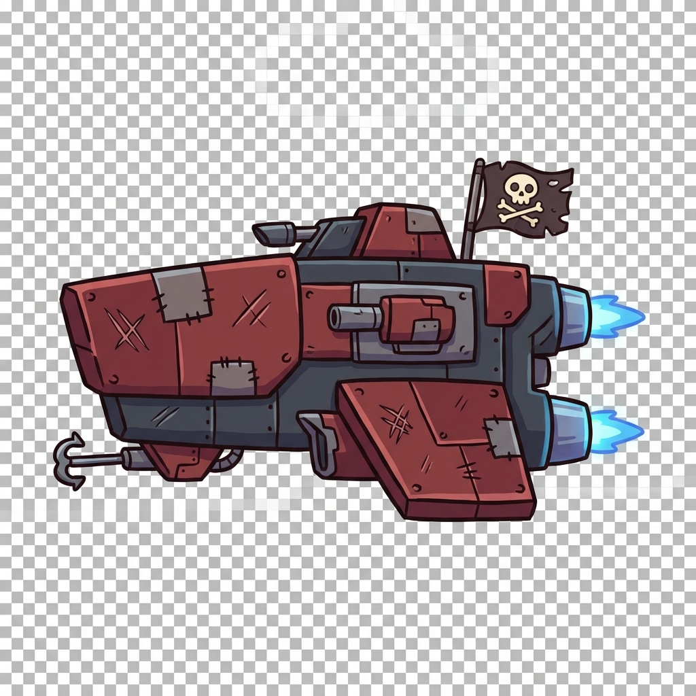
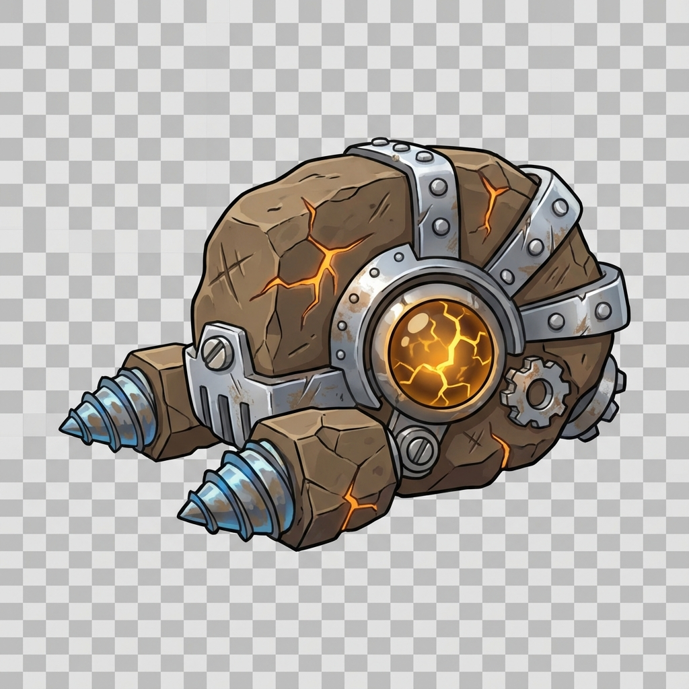
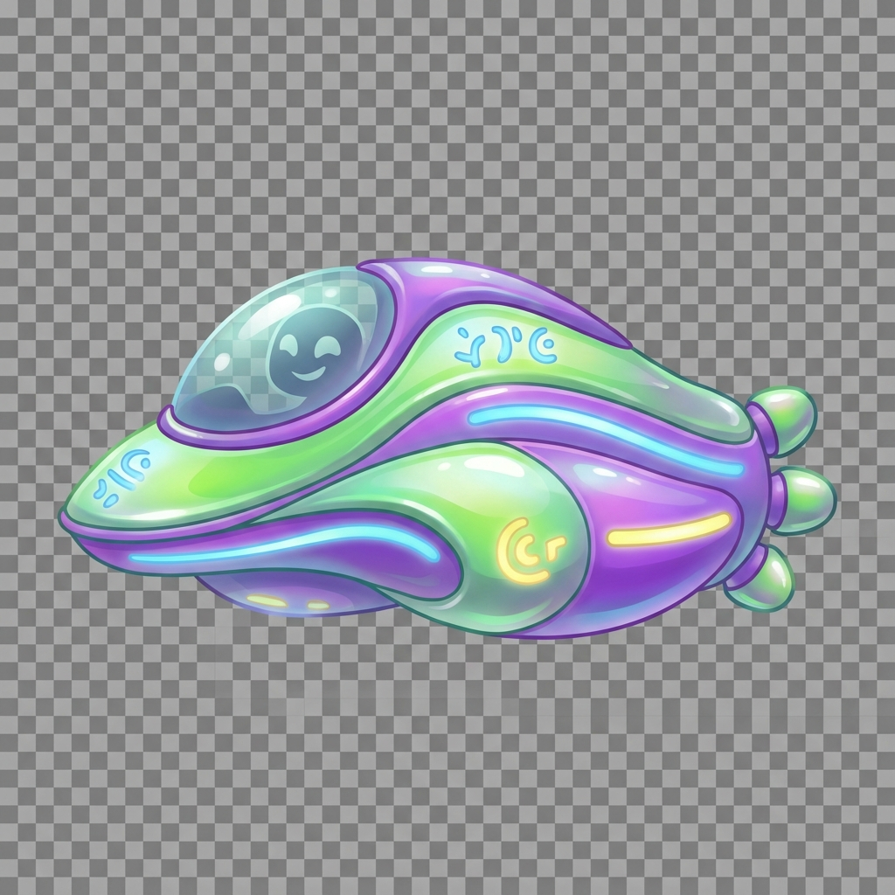
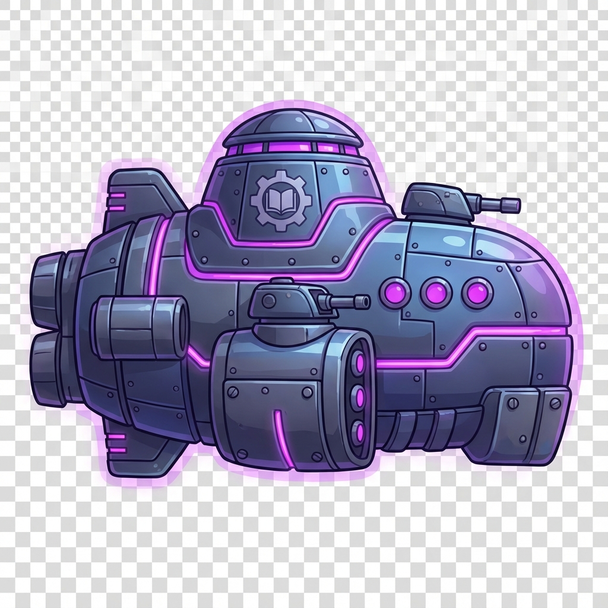

# Art Guide: Space Math Academy

## Overview

This art guide provides comprehensive specifications and visual references for creating consistent, high-quality art assets for Space Math Academy. Use this guide when generating new art content to ensure visual cohesion across all game elements.

> [!IMPORTANT]
> All art assets should follow the **child-friendly aesthetic** defined in the [Visual Style Guide](./visual-style-guide.md). Ensure designs are optimistic, adventurous, and appropriate for ages 6-12.

---

## Table of Contents

1. [Player Ships](#player-ships)
2. [Enemy Ships](#enemy-ships)
3. [Weapon Modules](#weapon-modules)
4. [Shield Modules](#shield-modules)
5. [Background Objects](#background-objects)
6. [Visual Effects](#visual-effects)
7. [UI Elements](#ui-elements)
8. [Art Creation Workflow](#art-creation-workflow)

---

## Player Ships

Player ships evolve visually as players progress through the game. Each tier should show clear visual progression and increased complexity.

### Ship Tier 1: Basic Ship (Starting)

**Purpose**: First ship, friendly and approachable for beginners

**Visual Specifications**:
- **Size**: 120px × 80px
- **Shape**: Simple geometric (triangle/arrow)
- **Primary Color**: #4A90E2 (Friendly Blue)
- **Glow**: Subtle cyan outline (#00D9FF)
- **Details**: Minimal, clean lines, simple cockpit window
- **Engine**: Single small thruster with gentle glow
- **Modules**: No visible module slots

**Design Notes**:
- Keep design simple and recognizable
- Should look friendly and non-threatening
- Clearly directional (front vs back obvious)
- Small enough to not dominate screen

**Example**:



---

### Ship Tier 2: Upgraded Ship (Mid-Game)

**Purpose**: Shows progression, more capable appearance

**Visual Specifications**:
- **Size**: 160px × 100px
- **Shape**: Complex geometry with wings/fins
- **Primary Color**: Gradient from #00D9FF to #4A90E2
- **Glow**: Enhanced cyan with subtle energy trails
- **Details**: Panel lines, vents, cockpit detail
- **Engine**: Dual thrusters with brighter glow
- **Modules**: 2-3 visible module attachment points

**Design Notes**:
- More angular and technical looking
- Wings/fins provide sense of speed
- Panel lines suggest modular construction
- Energy trails hint at increased power
- Module slots should be obvious mounting points

**Example**:



---

### Ship Tier 3: Advanced Ship (End-Game)

**Purpose**: Peak achievement, impressive and powerful

**Visual Specifications**:
- **Size**: 200px × 120px
- **Shape**: Intricate multi-section design
- **Primary Color**: Multi-color gradient (cyan, purple, metallic gold accents)
- **Glow**: Intense energy effects, particle trails
- **Details**: Complex panel work, animated components, special effects
- **Engine**: Multiple thrusters with intense glow and particles
- **Modules**: 4-6 visible modules integrated into design

**Design Notes**:
- Should look prestigious and powerful
- Multiple sections suggest complexity
- Metallic accents (gold, silver) show elite status
- Particle effects should be subtle but present
- Animated elements (rotating parts, pulsing lights)
- Integrated modules should be part of ship silhouette

**Example**:



---

## Enemy Ships

Enemy ships should have distinct silhouettes and clearly communicate their role and difficulty level.

### Space Pirate Ship

**Type**: Balanced enemy (common)  
**Difficulty**: Medium  
**Unlocked**: Sector 1-3

**Visual Specifications**:
- **Size**: 140px × 90px
- **Shape**: Angular, aggressive, asymmetric
- **Primary Colors**: Dark red (#8B0000), grey (#505050)
- **Accent Colors**: Orange (#FF6B35) for weapons/engines
- **Details**: Battle scars, patched hull, visible weapons
- **Engine**: Uneven thrust (suggests rough maintenance)
- **Special Features**: Skull or pirate symbols (child-friendly)

**Design Notes**:
- Should look menacing but NOT scary to kids
- Battle-worn appearance (scratches, different colored panels)
- Asymmetric design suggests improvised modifications
- Visible weapons (cannons, missile pods)
- Contrasts with player's clean, organized ships

**Example**:



---

### Asteroid Drone

**Type**: Weak enemy (high numbers)  
**Difficulty**: Low  
**Unlocked**: Sector 2 (Asteroid Belt)

**Visual Specifications**:
- **Size**: 80px × 60px (small)
- **Shape**: Compact, industrial, boxy
- **Primary Colors**: #8B7355 (Rocky Brown), #C0C0C0 (Metallic Silver)
- **Accent Colors**: #FF8C42 (Rust Orange) for core/engine
- **Details**: Drill arms, mining equipment, simple geometry
- **Engine**: Single small thruster
- **Special Features**: Glowing power core visible

**Design Notes**:
- Simple, utilitarian design (mining equipment repurposed)
- Small size emphasizes low threat
- Industrial look (bolts, panels, functional)
- Rocky textures or asteroid fragments attached
- Glowing orange core is weak point visually

**Example**:



---

### Alien Scout

**Type**: Fast, evasive enemy  
**Difficulty**: Medium-High  
**Unlocked**: Sector 5 (Alien Territory)

**Visual Specifications**:
- **Size**: 120px × 70px (sleek)
- **Shape**: Smooth, organic curves, streamlined
- **Primary Colors**: #39FF14 (Alien Green), #8B00FF (Deep Violet)
- **Accent Colors**: #FFD700 (Golden Yellow) for symbols
- **Details**: Alien glyphs, bio-mechanical elements, no hard edges
- **Engine**: Glowing energy field (no visible thrusters)
- **Special Features**: Mysterious glowing symbols, elegant design

**Design Notes**:
- Smooth, flowing lines (contrast with human angular ships)
- Organic appearance (bio-ship aesthetic)
- Mysterious alien symbols that glow
- Advanced technology (energy shields visible)
- Elegant and graceful, not threatening
- Hints at intelligence and advanced culture

**Example**:



---

### Capital Ship (Boss)

**Type**: Boss enemy  
**Difficulty**: Very High  
**Unlocked**: End of each sector

**Visual Specifications**:
- **Size**: 300px × 180px (massive)
- **Shape**: Imposing, multi-level, fortress-like
- **Primary Colors**: #1A0033 (Void Black), #6A0DAD (Dark Purple)
- **Accent Colors**: #FF00FF (Magenta Glow) for weapons
- **Details**: Multiple weapon turrets, command bridge, heavy armor
- **Engine**: Multiple large thrusters with intense glow
- **Special Features**: Shield generators visible, antenna arrays

**Design Notes**:
- Much larger than all other ships (size = threat)
- Multiple distinct sections (bridge, weapons, engines)
- Heavily armored appearance (thick plating)
- Impressive but not scary (no skulls, spikes, or horror elements)
- Visible weak points (glowing sections, exposed reactors)
- Should feel like an accomplishment to defeat

**Example**:



---

### Space Anomaly (Puzzle Enemy)

**Type**: Special enemy (unique mechanics)  
**Difficulty**: Variable  
**Unlocked**: Sector 4 (Nebula Fields)

**Visual Specifications**:
- **Size**: 180px × 180px (irregular)
- **Shape**: Abstract, geometric patterns, non-ship-like
- **Primary Colors**: #B537F2 (Nebula Purple), #FF6EC7 (Cosmic Pink)
- **Accent Colors**: #00D9FF (Electric Cyan) for energy
- **Details**: Crystalline structures, energy patterns, mysterious geometry
- **Engine**: No engine (floats/phases)
- **Special Features**: Pulsing energy, phase in/out animations

**Design Notes**:
- Doesn't look like a traditional ship
- Abstract geometry (crystals, spheres, impossible shapes)
- Beautiful and mysterious, not threatening
- Clearly alien/otherworldly
- Puzzle-like appearance hints at special mechanics
- Energy patterns suggest it's alive or sentient

---

## Weapon Modules

Weapon modules are earned by completing math challenges. Each weapon type corresponds to a math skill and has 5 levels of increasing power.

### Module Display Format

All weapon module icons follow these standards:
- **Icon Size**: 64px × 64px
- **Background**: Dark space (#0A0E27) with subtle glow
- **Border**: 2px solid in weapon color
- **Glow**: Matching color with 0 0 20px rgba() glow
- **Level Indicator**: Small badge in top-right corner

---

### Laser Cannon (Addition)

**Math Skill**: Addition  
**Attack Style**: Straight beam, instant hit  
**Color**: #00D9FF (Cyan Glow)

**Visual Specifications**:
- **Shape**: Straight beam emitter, cylindrical barrel
- **Details**: Energy focusing lens, power conduits
- **Effect**: Straight cyan beam from ship to target
- **Level Progression**:
  - **Level 1**: Single thin beam, minimal glow
  - **Level 2**: Slightly thicker beam, moderate glow
  - **Level 3**: Thick beam with bright glow and particle trail
  - **Level 4**: Dual beams converging to one point
  - **Level 5**: Triple beam with intense glow and lightning effects

**Icon Prompt for Generation**:
```
A laser cannon weapon module icon, straight beam emitter design, 
cyan blue color #00D9FF, glowing energy core, sleek futuristic weapon,
small compact module, visible energy conduits, child-friendly tech aesthetic,
icon view 64x64px, isolated on dark space background with cyan glow
```

---

### Missile Launcher (Subtraction)

**Math Skill**: Subtraction  
**Attack Style**: Projectile with travel time  
**Color**: #FF6B35 (Solar Orange)

**Visual Specifications**:
- **Shape**: Projectile launcher with missile pods
- **Details**: Missile tubes, targeting system, exhaust vents
- **Effect**: Missile projectile with orange trail and explosion on impact
- **Level Progression**:
  - **Level 1**: Single missile, small explosion
  - **Level 2**: Faster missile, bigger explosion
  - **Level 3**: Dual missiles launched simultaneously
  - **Level 4**: Triple missiles with homing capability
  - **Level 5**: Missile barrage (5 missiles) with large explosions

**Icon Prompt for Generation**:
```
A missile launcher weapon module icon, projectile launcher design with missile pods,
solar orange color #FF6B35, visible missiles ready to fire, compact module design,
mechanical details, child-friendly tech aesthetic, icon view 64x64px,
isolated on dark space background with subtle orange glow
```

---

### Plasma Beam (Multiplication)

**Math Skill**: Multiplication  
**Attack Style**: Wide wave beam  
**Color**: #B537F2 (Nebula Purple)

**Visual Specifications**:
- **Shape**: Wave emitter with energy coils
- **Details**: Pulsing coils, plasma chamber, purple glow
- **Effect**: Wavy purple energy beam, undulating motion
- **Level Progression**:
  - **Level 1**: Thin wave, gentle undulation
  - **Level 2**: Wider wave, more pronounced movement
  - **Level 3**: Wide wave with particle effects
  - **Level 4**: Double wave (two parallel beams)
  - **Level 5**: Massive wave with lightning arcs and intense purple glow

**Icon Prompt for Generation**:
```
A plasma beam weapon module icon, wave emitter design with energy coils,
nebula purple color #B537F2, glowing purple energy, wavy energy patterns,
advanced alien technology look, child-friendly aesthetic, icon view 64x64px,
isolated on dark space background with purple glow and particle effects
```

---

### Ion Blaster (Division)

**Math Skill**: Division  
**Attack Style**: Energy sphere projectile  
**Color**: #39FF14 (Neon Green)

**Visual Specifications**:
- **Shape**: Sphere projector with visible energy chamber
- **Details**: Sphere containment field, electrical arcs, green glow
- **Effect**: Green energy sphere travels to target with electric arcs
- **Level Progression**:
  - **Level 1**: Small sphere, minimal electricity
  - **Level 2**: Larger sphere, visible electric arcs
  - **Level 3**: Large sphere with electric arcs reaching out
  - **Level 4**: Massive sphere with chain lightning to nearby enemies
  - **Level 5**: Huge sphere with intense electricity and area damage

**Icon Prompt for Generation**:
```
An ion blaster weapon module icon, sphere projector design with sphere chamber,
neon green color #39FF14, glowing green energy sphere visible, electrical arcs,
exotic high-tech design, child-friendly aesthetic, icon view 64x64px,
isolated on dark space background with green electric glow
```

---

## Shield Modules

Shield modules protect the player ship from damage. Each shield type corresponds to a math skill.

### Energy Shield (Fractions)

**Math Skill**: Fractions  
**Defense Type**: Hexagonal energy barrier  
**Color**: #00D9FF (Cyan)

**Visual Specifications**:
- **Shape**: Hexagonal barrier projector
- **Details**: Hexagon generator, energy nodes
- **Effect**: Translucent cyan dome with hexagonal pattern
- **Level Progression**:
  - **Level 1**: Faint hexagons, slow recharge (5 turns)
  - **Level 2**: Visible hexagons, moderate recharge (4 turns)
  - **Level 3**: Bright hexagons with energy flow, recharge (3 turns)
  - **Level 4**: Intense hexagons with particle effects, recharge (2 turns)
  - **Level 5**: Maximum intensity hexagons, instant recharge (1 turn)

**Idle Animation**: Gentle pulse (opacity 0.6 to 0.8)  
**Impact Animation**: Ripple effect from impact point

**Icon Prompt for Generation**:
```
An energy shield module icon, hexagonal barrier projector design,
cyan color #00D9FF, transparent hexagonal energy dome visible,
defensive technology, glowing energy nodes, child-friendly sci-fi aesthetic,
icon view 64x64px, isolated on dark space background with cyan glow
```

---

### Deflector Shield (Decimals)

**Math Skill**: Decimals  
**Defense Type**: Angular panel barrier  
**Color**: #5F9EFF (Sky Blue)

**Visual Specifications**:
- **Shape**: Angular barrier with geometric panels
- **Details**: Rotating panels, energy conduits
- **Effect**: Geometric blue panels that rotate around ship
- **Level Progression**:
  - **Level 1**: Simple panels, slow rotation
  - **Level 2**: More panels, moderate rotation
  - **Level 3**: Bright rotating panels with glow
  - **Level 4**: Fast rotating panels with trail effects
  - **Level 5**: Intense panels with deflection beams

**Idle Animation**: Panels slowly rotate around ship  
**Impact Animation**: Panels flash and deflect projectile

**Icon Prompt for Generation**:
```
A deflector shield module icon, angular barrier design with geometric panels,
sky blue color #5F9EFF, rotating energy panels visible, technical design,
glowing panel edges, child-friendly tech aesthetic, icon view 64x64px,
isolated on dark space background with blue glow
```

---

## Background Objects

Background objects add depth and context to space environments. Each sector has unique background elements.

### Planets

**Purpose**: Large background elements, sector identity

#### Rocky Planet (Sector 1-2)
- **Size**: 200-400px diameter
- **Colors**: Browns, oranges, grays
- **Features**: Craters, mountain ranges, desert areas
- **Atmosphere**: Thin or none
- **Details**: Surface textures, shadows, subtle rotation

#### Ice Planet (Sector 3)
- **Size**: 250-500px diameter
- **Colors**: White, light blue (#A8E6FF), cyan
- **Features**: Ice caps, frozen oceans, glaciers
- **Atmosphere**: Thin blue-white
- **Details**: Crystalline reflections, ice cracks, aurora in atmosphere

#### Gas Giant (Sector 4-5)
- **Size**: 400-600px diameter
- **Colors**: Purple, pink, orange bands
- **Features**: Storm systems, cloud bands, great spots
- **Atmosphere**: Thick, colorful layers
- **Details**: Swirling clouds, lightning in storms, rings optional

**Planet Generation Prompt Template**:
```
A [planet type] for kids' educational space game, [size] diameter,
[color palette], visible [features], [atmosphere description],
child-friendly cartoon-realistic style, space background,
appropriate for ages 6-12, high contrast, vibrant colors
```

---

### Asteroids

**Purpose**: Small obstacles, mining resources

**Visual Specifications**:
- **Sizes**: Small (30px), Medium (60px), Large (100px)
- **Colors**: Rocky brown (#8B7355), gray (#808080), metallic silver
- **Features**: Irregular shapes, craters, mineral veins
- **Details**: Rotating slowly, mineral glints, shadow side
- **Special**: Some with resources (glowing veins of color)

**Asteroid Types**:
1. **Common Rock**: Brown/gray, no special features
2. **Metallic Ore**: Silver/gold glints, valuable appearance
3. **Ice Asteroid**: White/blue, crystalline appearance
4. **Alien Artifact**: Mysterious glowing sections, smooth sections

**Generation Prompt**:
```
A [type] asteroid for kids' space game, [size]px, irregular rocky shape,
[color] with [features], slowly rotating, child-friendly style,
isolated on transparent background, space rock, appropriate for ages 6-12
```

---

### Nebulas

**Purpose**: Atmospheric backgrounds, sector themes

**Visual Specifications**:
- **Size**: Full screen background (1920px × 1080px)
- **Opacity**: 20-40% (semi-transparent)
- **Colors**: Match sector palette
- **Pattern**: Wispy, cloud-like, flowing
- **Details**: Color gradients, star formation regions, internal glow

**Nebula Types by Sector**:

1. **Training Zone**: None or very subtle blue nebula
2. **Asteroid Belt**: Brown/orange dust clouds
3. **Ice Planets**: Blue-white ice clouds
4. **Nebula Fields**: Purple/pink/cyan vibrant nebula
5. **Alien Territory**: Green/violet mysterious nebula
6. **Black Hole Region**: Dark purple with magenta accents

**Generation Prompt**:
```
A space nebula background for kids' educational game, [sector colors],
wispy cloud-like formations, [opacity]% transparent, flowing patterns,
beautiful cosmic clouds, child-friendly aesthetic, 1920x1080px,
appropriate for ages 6-12, vibrant but not overwhelming
```

---

### Space Stations

**Purpose**: Landmarks, mission hubs, safe zones

**Visual Specifications**:
- **Size**: 250-350px
- **Shape**: Modular, geometric, human-built appearance
- **Colors**: Gray/white hull, cyan/blue lights, orange windows
- **Features**: Docking bays, antenna arrays, solar panels, rotating sections
- **Details**: Panel lines, lights in windows, identification markings

**Station Types**:
1. **Research Station**: Labs, satellite dishes, clean appearance
2. **Trading Post**: Cargo bays, various ships docked, busy appearance
3. **Military Outpost**: Defensive turrets, thick armor, fortified
4. **Repair Dock**: Mechanical arms, ships in repair, industrial

**Generation Prompt**:
```
A space station for kids' educational game, [type] design, [size]px,
modular geometric structure, gray/white hull with cyan lights,
[features], child-friendly sci-fi aesthetic, side view,
isolated on transparent background, appropriate for ages 6-12
```

---

### Stars and Particles

**Purpose**: Ambient background, depth, atmosphere

#### Background Stars
- **Sizes**: Tiny (1-2px), Small (3-4px), Medium (5-6px)
- **Colors**: White (#FFFFFF) with various opacity (30%-100%)
- **Animation**: Some twinkling (opacity pulse)
- **Density**: Sparse in foreground, dense in background
- **Distribution**: Random but natural clusters

#### Particle Effects
- **Energy Particles**: Small glowing dots following energy beams
  - Color: Match weapon/effect color
  - Size: 2-4px
  - Behavior: Trail behind, fade out
  
- **Explosion Particles**: Burst effect on impacts
  - Color: Orange/yellow/red
  - Size: 4-10px
  - Behavior: Explode outward, fade and shrink

- **Space Dust**: Ambient drifting particles
  - Color: White/gray, low opacity
  - Size: 1-3px
  - Behavior: Slow drift, parallax effect

---

## Visual Effects

Visual effects provide feedback and enhance the game experience. All effects should be child-friendly and celebratory rather than violent.

### Combat Effects

#### Laser Beam Effect
```css
Width: 4-12px (based on level)
Length: Distance from ship to target
Color: #00D9FF with glow
Animation: Fade in 100ms, hold 300ms, fade out 200ms
Glow: 0 0 20px rgba(0, 217, 255, 0.8)
```

**Implementation**:
- Draw line from weapon mount point to impact point
- Add glow effect using box-shadow or SVG filter
- Particle trail along beam path
- Flash at impact point

---

#### Missile Trail Effect
```css
Color: #FF6B35 (orange) fading to transparent
Width: 3px
Length: 40-60px trail
Animation: Particle spawning every 50ms
Particle Life: 500ms fade out
```

**Implementation**:
- Missile sprite moves along path
- Trail particles spawn at missile position
- Particles fade out and shrink over 500ms
- Explosion effect at impact

---

#### Shield Impact Effect
```css
Impact Location: Point where projectile hits shield
Effect: Ripple expanding from impact
Color: Shield color with increased brightness
Animation: Expand from 0 to 200px radius over 400ms
Opacity: 1.0 to 0.0
```

**Implementation**:
- Create expanding circle at impact point
- Hexagon pattern for Energy Shield
- Panel flash for Deflector Shield
- Fade out as it expands

---

#### Explosion Effect
```css
Size: 60-150px (based on weapon level)
Colors: #FF6B35 (orange) core, #FFA502 (yellow) outer
Duration: 600ms
Particles: 20-30 particles exploding outward
Shake: Subtle screen shake (2-4px)
```

**Implementation**:
- Central bright flash (100ms)
- Expanding circle with gradient (300ms)
- Particles flying outward (600ms)
- Subtle screen shake for large explosions
- Sound effect (explosion appropriate for kids)

---

### Feedback Effects

#### Correct Answer
```css
Animation: Scale pulse (100% → 110% → 100%)
Duration: 400ms
Color Flash: #00FF88 (bright green)
Particles: 15-20 green sparkles bursting
Sound: Positive chime
```

**Visual Elements**:
- Math problem container pulses with green glow
- Green sparkle particles burst from center
- Checkmark icon appears briefly
- Positive sound effect

---

#### Incorrect Answer
```css
Animation: Shake (0 → -10px → +10px → 0)
Duration: 300ms
Color Flash: #FF4757 (brief red flash, not harsh)
Effect: Gentle shake
Sound: Soft buzz (not harsh or scary)
```

**Visual Elements**:
- Gentle shake animation (not violent)
- Brief red flash on border
- Answer clears automatically
- Encouraging message appears
- Soft sound (not punishing)

---

#### Level Up
```css
Animation: Scale + rotate (0.8 + -5deg → 1.2 + 5deg → 1.0 + 0deg)
Duration: 800ms
Effects: Star burst, glow pulse, confetti
Color: #FFD700 (gold) with #B537F2 (purple) accents
Sound: Triumphant fanfare
```

**Visual Elements**:
- Large "LEVEL UP!" text with animation
- Star burst effect from ship
- Glowing ring expanding from ship
- Colorful confetti particles
- New ship appearance transition
- Celebratory sound effect

---

### Ambient Effects

#### Engine Glow
```css
Color: Cyan/orange based on ship
Size: 15-40px (based on ship size)
Animation: Pulse (brightness 80% to 100%)
Duration: 1000ms infinite
Particles: Small exhaust particles
```

**Implementation**:
- Glowing ellipse at engine position
- Gentle brightness pulse
- Small particles trailing behind ship
- Intensity increases during movement

---

#### Shield Idle Animation
```css
Opacity: Pulse between 60% and 80%
Duration: 2000ms infinite
Pattern: Shield-specific (hexagons or panels)
Glow: Subtle matching color
```

**Implementation**:
- Translucent dome/barrier around ship
- Gentle opacity pulse
- Pattern overlay (hexagons or panels)
- Rotates slowly (deflector shield)

---

#### Space Ambient
- **Stars Twinkling**: Random stars pulse opacity
- **Nebula Movement**: Very slow drift/shift of nebula clouds
- **Planet Rotation**: Slow rotation of planets (1 rotation per 60-120 seconds)
- **Asteroid Tumbling**: Slow rotation of asteroids
- **Station Lights**: Blinking lights on stations (navigation lights)

---

## UI Elements

UI elements should be consistent with the visual style guide while maintaining clarity and usability.

### Buttons

#### Primary Button (Example Specs for Image Generation)
```
Size: 200px × 60px
Background: Gradient from #00D9FF to #0099CC
Text: "START MISSION" in Orbitron Bold 18px
Text Color: #0A0E27 (dark for contrast)
Border: 2px solid #00FFFF
Border Radius: 12px
Shadow: 0 4px 16px rgba(0, 217, 255, 0.4)
```

**Generation Prompt**:
```
A primary button for kids' space game UI, 200x60px, cyan gradient background,
text "START MISSION" in futuristic font, glowing cyan border, rounded corners,
shadow effect, child-friendly game UI, modern design
```

---

#### Secondary Button
```
Size: 180px × 54px
Background: Transparent with #00D9FF border (2px)
Text: "VIEW DETAILS" in Orbitron Medium 18px
Text Color: #00D9FF
Border Radius: 12px
Hover: Background rgba(0, 217, 255, 0.1)
```

---

### Cards

#### Mission Card (Example)
```
Size: 320px × 240px
Background: Gradient rgba(26, 31, 58, 0.9) to rgba(45, 53, 97, 0.9)
Border: 2px solid rgba(0, 217, 255, 0.3)
Border Radius: 20px
Padding: 32px
Shadow: 0 8px 32px rgba(0, 0, 0, 0.4)
```

**Contents**:
- Mission icon (64px × 64px) top left
- Mission title: Orbitron Bold 24px, #00D9FF
- Difficulty stars: 5 stars, filled/empty
- Math skill badge: Pill-shaped, matching skill color
- Description: Inter Regular 16px, #B8C5D6
- Reward preview: Small module icons
- "Start" button at bottom

---

#### Module Card
```
Size: 200px × 280px
Background: Radial gradient rgba(0, 217, 255, 0.15) to rgba(26, 31, 58, 0.9)
Border: 2px solid #00D9FF
Border Radius: 16px
Padding: 20px
Shadow: 0 4px 16px rgba(0, 217, 255, 0.3)
```

**Contents**:
- Module icon (64px × 64px) centered top
- Module name: Orbitron Medium 18px
- Level indicator: Top right corner badge
- Stats bars: Attack/Defense/Energy
- Math skill badge: Matches skill color
- Equip/Unequip button

---

### Progress Bars

#### Experience Bar
```
Width: 300px
Height: 16px
Background: rgba(10, 14, 39, 0.6)
Border: 1px solid rgba(181, 55, 242, 0.3)
Border Radius: 20px
Fill: Gradient from #B537F2 to #FF6EC7
Fill Glow: 0 0 10px rgba(181, 55, 242, 0.6)
Label: Inter Bold 14px, center-aligned
```

---

#### Health Bar
```
Width: 200px
Height: 32px
Background: rgba(139, 0, 0, 0.3)
Border: 2px solid rgba(255, 71, 87, 0.5)
Border Radius: 8px
Fill: Gradient from #FF4757 to #FF6B7A
Low Health (<25%): Pulse animation + red glow
```

---

### Badges

#### Achievement Badge
```
Size: 80px × 80px
Shape: Circle
Background: Radial gradient rgba(181, 55, 242, 0.2) to transparent
Border: 2px solid #B537F2
Icon: 56px × 56px centered
Glow: 0 4px 20px rgba(181, 55, 242, 0.4)
Locked State: Grayscale + opacity 30% + dashed border
```

---

## Art Creation Workflow

Follow this workflow when creating new art assets to ensure consistency and quality.

### 1. Reference Existing Guides

Before creating any asset, review:
- [Visual Style Guide](./visual-style-guide.md) - Color palette, typography, design principles
- This Art Guide - Specific asset specifications
- Existing assets - Ensure visual consistency

### 2. Define Specifications

For each new asset, define:
- **Purpose**: What is this asset for?
- **Size**: Exact pixel dimensions
- **Colors**: Primary, secondary, accent colors from palette
- **Style**: Match existing aesthetic (semi-realistic, child-friendly)
- **Details**: Key visual elements that must be included

### 3. Create Prompt (For AI Generation)

Structure your generation prompt:
```
A [asset description] for kids' educational space game,
[size] dimensions, [color palette], [key features],
[style notes], child-friendly aesthetic,
[viewing angle], isolated on [background],
appropriate for ages 6-12
```

**Prompt Best Practices**:
- Specify exact colors from palette when possible
- Include "child-friendly" or "appropriate for ages 6-12"
- Describe style as "modern semi-realistic" or "cartoon-realistic"
- Be specific about size and proportions
- Mention viewing angle (front, side isometric)
- Request transparent background or specific background color

### 4. Generate Multiple Variations

- Create 2-3 variations of each asset
- Test different styles or angles
- Compare against existing assets
- Choose best fit for game aesthetic

### 5. Review Checklist

Before finalizing any asset, verify:

- [ ] **Matches Color Palette**: Uses colors from visual style guide
- [ ] **Appropriate Size**: Correct dimensions for use case
- [ ] **Child-Friendly**: No scary, violent, or inappropriate elements
- [ ] **Clear Silhouette**: Recognizable even at small sizes
- [ ] **Consistent Style**: Matches existing game assets
- [ ] **High Contrast**: Readable against space backgrounds
- [ ] **Technical Quality**: Clean edges, no artifacts
- [ ] **File Format**: PNG with transparency or specified format

### 6. Create Animation States (If Applicable)

For animated assets, create:
- **Idle state**: Default appearance
- **Active/hover state**: When interacted with
- **Disabled state**: Grayed out, lower opacity
- **Transition frames**: If needed for smooth animation

### 7. Document The Asset

Add to asset library with:
- File name (descriptive, lowercase, underscores)
- Dimensions
- Color codes used
- Purpose/usage notes
- Related assets (variants, levels)
- Date created

### 8. Test In Context

- Place asset in actual game environment
- Test at actual display size
- Verify readability and visibility
- Check against multiple backgrounds
- Test on different screen sizes

---

## Asset Naming Conventions

Use consistent naming for all assets:

### Format
```
[category]_[type]_[variant]_[level/state].png
```

### Examples
```
ship_player_basic.png
ship_player_upgraded.png
ship_enemy_pirate_damaged.png
weapon_laser_icon_level1.png
weapon_laser_effect.png
bg_planet_ice_large.png
bg_nebula_purple.png
ui_button_primary_normal.png
ui_button_primary_hover.png
effect_explosion_small.png
shield_energy_active.png
```

### Category Prefixes
- `ship_` - Spaceships (player and enemy)
- `weapon_` - Weapon modules
- `shield_` - Shield modules
- `armor_` - Armor components
- `bg_` - Background objects (planets, asteroids, etc.)
- `effect_` - Visual effects (explosions, beams, etc.)
- `ui_` - UI elements (buttons, cards, etc.)
- `icon_` - Icons and badges
- `particle_` - Particle system elements

---

## Color Quick Reference

For easy access while creating assets:

### Primary Palette
```
Deep Space Navy: #0A0E27
Midnight Blue: #1A1F3A
Cosmic Blue: #2D3561
Cyan Glow: #00D9FF
Solar Orange: #FF6B35
Nebula Purple: #B537F2
Neon Green: #39FF14
```

### UI Colors
```
Success: #00FF88
Error: #FF4757
Warning: #FFA502
Info: #5F9EFF
Neutral: #8B93B0
```

### Text Colors
```
Primary Text: #FFFFFF
Secondary Text: #B8C5D6
Disabled Text: #6B7A8F
Highlighted Text: #00D9FF
```

---

## Additional Resources

### Sector-Specific Palettes

Reference sector palettes from [visual-style-guide.md](./visual-style-guide.md#22-sector-specific-palettes) when creating sector-themed assets.

### Typography

Use fonts specified in [visual-style-guide.md](./visual-style-guide.md#3-typography):
- **Orbitron**: Headers, UI elements
- **Inter**: Body text, descriptions
- **JetBrains Mono**: Numbers, calculations

### Animation Guidelines

Reference animation timing and easing functions in [visual-style-guide.md](./visual-style-guide.md#6-animation-principles).

---

## Appendix: Generation Prompts Summary

### Quick Prompt Templates

**Player Ship**:
```
A [tier] spaceship for kids' educational space game, [size]px,
[shape description], [color] with [glow color] glow,
[details], modern semi-realistic style, child-friendly,
front-facing view, transparent background
```

**Enemy Ship**:
```
A [enemy type] ship for kids space game, [size]px,
[threat level] design, [colors], [features],
child-friendly (not scary), side view, transparent background,
appropriate for ages 6-12
```

**Module Icon**:
```
A [module type] module icon for kids space game,
[design description], [color] #[hex], 64x64px icon view,
glowing effects, child-friendly tech aesthetic,
dark space background with subtle glow
```

**Background Object**:
```
A [object type] for kids space game, [size]px,
[colors and features], child-friendly [style],
[angle], [background], appropriate for ages 6-12,
vibrant colors, high contrast
```

**Effect**:
```
A [effect type] visual effect for kids space game,
[colors], [animation description], child-friendly,
celebratory/feedback theme, transparent background,
appropriate for ages 6-12
```

---

## Conclusion

This art guide provides the foundation for creating consistent, engaging visual assets for Space Math Academy. Remember:

1. **Always prioritize child-friendliness** - no scary or violent imagery
2. **Maintain visual consistency** - use established color palettes and styles
3. **Test in context** - verify assets work in actual game environment
4. **Document your work** - help others understand your creative decisions
5. **Iterate and improve** - gather feedback and refine assets

When in doubt, refer back to the [Visual Style Guide](./visual-style-guide.md) and existing assets for guidance.

---

**Document Version**: 1.0  
**Last Updated**: 2025-11-27  
**Author**: Space Math Academy Team  
**Status**: Initial Release

