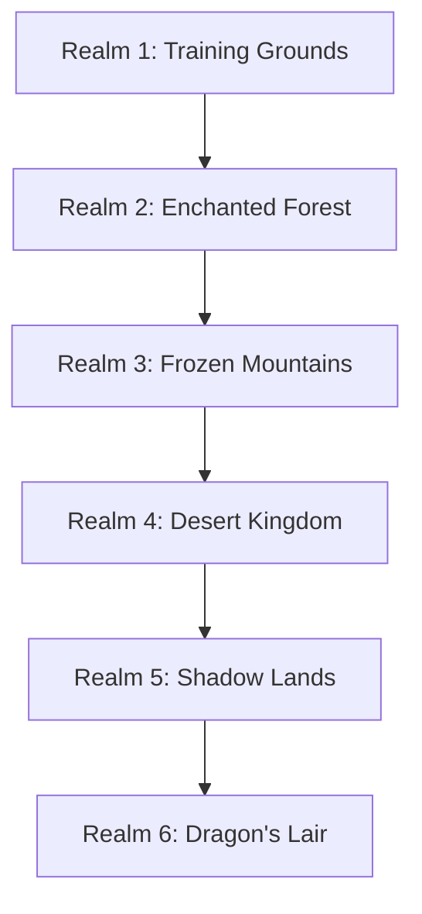

# Game Design Document: Math Quest Adventures

## Executive Summary

**Game Title:** Math Quest Adventures (working title)

**Target Audience:** Children ages 6-12

**Platform:** Web Browser (Desktop & Tablet)

**Genre:** Educational Fantasy Adventure / RPG Lite

**Core Concept:** Players embark on an epic **Journey** through magical realms, leading an adventuring party. The Journey is divided into many **Adventures**, each with its own theme, story, and map featuring a linear set of **Encounters**. Some encounters involve battles against monsters, while others present puzzles to solve. Each adventure culminates in a **Boss Fight**. Completing an adventure rewards players with either a new companion or **Companion Growth** (existing companions learn new skills and gain experience). The party grows from a small band to a formidable fellowship of heroes.

---

### 1. Game Overview

### 1.1 Vision Statement
Math Quest Adventures transforms math learning into an exciting fantasy **Journey** where every challenge overcome makes your party stronger. Players lead their own fellowship through multiple **Adventures**, each containing a series of **Encounters** (battles and puzzles) that culminate in epic **Boss Fights**. Companions solve contextual math challenges to achieve **Companion Growth**, defeat monsters, and unlock new regions of the realm.

### 1.2 Core Gameplay Loop

### 1.3 Key Features
- **Epic Journey**: Progress through multiple themed adventures, each with unique stories and maps
- **Progressive Math Curriculum**: Adaptive difficulty that grows with player skill
- **Companion Collection**: Recruit diverse heroes, each with unique abilities
- **Party Customization**: Choose 4 companions to take on each adventure
- **Companion Growth System**: Companions learn new skills and gain experience - no equipment micromanagement
- **Linear Adventure Maps**: Each adventure features a sequence of encounters leading to a boss fight
- **Encounter Variety**: Face monster battles and solve puzzles (future feature)
- **Boss Fights**: Epic climactic battles at the end of each adventure
- **Reward System**: Immediate feedback and tangible progression through companion growth

---

## 2. Game Mechanics

### 2.1 Journey & Adventure System

#### Journey Structure
The player's overall progression is called the **Journey**. The Journey is divided into multiple **Adventures**, each representing a self-contained story arc with its own theme, map, and challenges. Additional **Journey**s can be purchased as DLCs. Progressing through new journeys unlocks new companions, and styling options for Magical Canvas

#### Adventure Structure
Each **Adventure** consists of:
- **Theme & Story**: Unique narrative context (e.g., "The Goblin Forest", "Dragon's Lair")
- **Linear Map**: A path of connected nodes representing encounters
- **Encounters**: Individual challenges along the path (battles against monsters, or puzzles to solve)
- **Boss Fight**: The final, climactic encounter that must be defeated to complete the adventure
- **Completion Reward**: A new companion can join the party or new styling options for Magical Canvas becomes available

#### Adventure Types
1. **Training Adventures** (Tutorial)
   - Introduction to basic controls and mechanics
   - Simple math challenges (addition, subtraction)
   - Rewards: First companions, initial companion growth

2. **Exploration Adventures**
   - Discover hidden locations and secrets
   - Varied encounters with different monster types
   - Rewards: Companion unlocks, companion growth

3. **Story Adventures**
   - Narrative-driven adventures with character development
   - Mix of battle encounters and puzzle encounters (future)
   - Rewards: Companion unlocks, companion growth, story progression

4. **Challenge Adventures**
   - High-difficulty adventures for advanced players
   - Powerful boss fights requiring strategy
   - Rewards: Rare companions, significant companion growth

#### Encounter Types
- **Battle Encounters**: Turn-based battle against monsters
- **Puzzle Encounters**: Logic and math puzzles to solve (future feature)
- **Boss Fights**: Epic battle against powerful enemies at the end of each adventure
- **Camp Encounters**: Rest stops where players can adjust their party

### 2.2 Math Challenge System

#### Two-Dimensional Difficulty System

**Dimension 1: Math Skill** (determines which companion skill is enhanced)
- Addition
- Subtraction
- Multiplication
- Division
- Fractions
- Decimals
- Algebra basics

**Dimension 2: Difficulty Level** (determines companion growth level)
- **Level 1**: Small numbers (e.g., single-digit)
- **Level 2**: Medium numbers (e.g., double-digit)
- **Level 3**: Large numbers (e.g., triple-digit or complex operations)
- **Level 4**: Very large numbers or multi-step problems
- **Level 5**: Expert level challenges

Example: Completing "Multiplication - Level 3" adventure unlocks a companion or grants companion growth to Level 3

#### Challenge Presentation
- **Contextual Integration**: Math naturally woven into story scenarios (never explicit "math problems")
  - "The merchant needs 7 potions but only has 3. How many more should we buy?"
  - "There are goblins hiding behind rocks. Count them before they attack!"
  - "We found 24 gold coins. Split them fairly among your 4 companions."
  - "The bridge can hold 50 people. We have 32. How many more allies can cross?"
- **Multiple Choice**: For younger players
- **Free Input**: For older/advanced players  

#### Player-Controlled Difficulty
- Players choose both the math skill and difficulty level for each adventure
- Game encourages players to increase difficulty when they perform well (e.g., "You got 9/10 correct! Ready to try Level 3?")
- Game suggests trying easier difficulty or previous skills if player struggles (e.g., "That was tough! Want to practice Level 2 first?")
- No forced adjustments - player always has final choice
- Progress tracking shows performance by skill and difficulty to help inform choices

### 2.3 Companion System

#### Core Design Philosophy
- **Permanent Companions**: Once unlocked, companions are yours forever
- **No Equipment**: Companions upgrade directly (simpler for children)
- **Party Selection**: Choose which 4 companions to bring on each adventure
- **Diverse Heroes**: Each companion has unique personality, appearance, and role

### 2.4 Encounter System

#### Encounter Flow
1. **Meeting**: Player meets monster or monster group
2. **Action Phase**: Turn-based encounter begins
3. **Victory/Defeat**: Unlock new content or retry option

#### Encounter Mechanics (Turn-Based)
- **Player Turn**:
  - **Action Phase**: The player commands their party members. Each companion must act once per turn.
  - **Standard Abilities**: Companions use their class-based abilities (e.g., Warriors deal damage, Guardians provide shields, Supports heal).
  - **Completion**: The Player Turn ends automatically when all conscious companions have acted.

- **Spirit System (Ultimate Abilities)**:
  - **Spirit Accumulation**: Companions passively generate **Spirit** (e.g., +35) at the start of every Player Turn.
  - **Ultimate Ready**: When a companion reaches **100 Spirit**, their Standard Ability is replaced by their unique **Ultimate Ability**.
  - **High-Stakes Math Challenge**: Activating an Ultimate triggers a challenging math problem.
    - **Solve Correctly**: The Ultimate activates with a powerful effect (e.g., "Protective Stance", "Piercing Shot").
    - **Solve Incorrectly**: The ability **Fails**, consuming the Spirit and the turn without effect.
    - **Reset**: Spirit always resets to 0 after an Ultimate attempt (success or failure).

- **Monster Turn**:
  - **Sequential Attacks**: Monsters attack one by one with dramatic timing.
  - **Shield Mechanics**: Shields provide a temporary health pool that absorbs damage before HP is touched.

### 2.5 Progression System

#### Journey Progression Through Realms

Each realm contains multiple adventures:
- Unique visual theme
- Specific math focus areas
- New monster types
- New companions to unlock through adventure completion
- Final adventure with a boss fight that must be defeated to unlock next realm
- Special badge/achievement for defeating the realm boss

---

## 3. Reward System

### 3.1 Encounter & Adventure Rewards
- **Encounter XP**: Completing each encounter grants scaling XP rewards based on the encounter's position in the adventure (e.g., $10 \times i$ XP).
- **Companion Unlocks**: Completing an entire adventure unlocks a new companion who joins your party.
  - Example: Complete "The Oasis Quest" adventure → Unlock Tariq (Level 1)
- **Adventure Completion Bonus**: Completing adventures may grant a significant XP bonus to all active party members.

- **Content Unlocks**: Some adventures unlock new realms or adventure paths.
- **Boss Badges**: Defeating boss fights grants special achievement badges.

---

## 4. User Interface & Experience

### 4.1 The Magical Canvas (Creative Hub)
- **Concept**: A free-form sticker book/diorama creator where players can express themselves artistically.
- **My Scenes**: Players can create and save multiple scenes (e.g., "My Epic Battle", "Peaceful Forest").
- **Asset Collection**: 
  - **Stickers**: Characters, Monsters, Props, Backgrounds, Effects.
  - **Unlock Method**: Unlocked by playing Adventures, finding "Hidden Stickers" (loot), and leveling up Companions.
- **Creative Tools**:
  - **Free Placement**: Drag, drop, scale, rotate, and layer assets anywhere on the canvas.
  - **No Gameplay Constraints**: Pure artistic expression (e.g., placing a Goblin on a cloud).
- **Party Setup**: Accessed via a dedicated menu button, separating utility from creativity.
- **Adventure Map**: Accessible via the "Portal" icon.

### 4.2 Party Management Interface (The Roster)
- **Access**: Global button available from the Canvas and Map.
- **Functionality**:
  - **Team Selection**: Drag-and-drop interface to choose the 4 active companions.
  - **Companion Details**: Click any companion to view their "Card" (Stats, Abilities, Lore).
  - **Growth Visualization**: 
    - XP bars and "Next Level" previews.
    - "Evolution" animations play here when a companion levels up.
  - **Equipment/Skins**: Manage cosmetic skins (e.g., "Winter Fire Knight") unlocked via DLC.

### 4.3 Visual Design Principles
- **Child-Friendly**: Bright colors, clear icons, friendly characters
- **Fantasy Theme**: Castles, forests, magical effects, heroes and monsters
- **Feedback**: Animations for success/failure, level-ups
- **Accessibility**: Adjustable text size, colorblind modes
- **Character-Driven**: Companions have personality through dialogue and expressions

---

## 5. Educational Design

### 5.1 Math Curriculum Mapping

#### Grade 1-2 (Ages 6-7)
- Counting to 100
- Single-digit addition and subtraction
- Number recognition and ordering
- Basic shapes and patterns

#### Grade 3-4 (Ages 8-9)
- Multi-digit addition and subtraction
- Multiplication tables (1-12)
- Basic division
- Fractions (halves, quarters)
- Simple word problems

#### Grade 5-6 (Ages 10-11)
- Multi-digit multiplication and division
- Decimals and percentages
- Fraction operations
- Basic algebra (solving for x)
- Geometry (area, perimeter)

#### Grade 7+ (Ages 12+)
- Advanced algebra
- Ratios and proportions
- Negative numbers
- Order of operations
- Pre-algebra concepts

### 5.2 Learning Principles

**Spaced Repetition**
- Previously mastered concepts appear periodically
- Prevents skill decay
- Builds long-term retention

**Immediate Feedback**
- Correct answers: Positive reinforcement, rewards
- Incorrect answers: Show correct solution, offer retry
- No punishment, only learning opportunities

**Scaffolding**
- New concepts introduced gradually
- Build on previously mastered skills
- Provide support that fades as mastery increases

**Intrinsic Motivation**
- Progress is visible and meaningful
- Rewards are immediately useful
- Emotional connection to companions

---

## 6. Technical Considerations

### 6.1 Platform Requirements
- **Browser Compatibility**: Chrome, Firefox, Safari, Edge (latest versions)
- **Responsive Design**: Desktop (1024px+) and tablet (768px+)
- **Performance**: Smooth 60fps animations
- **Save System**: Cloud-based progress saving (account required)
- **Offline Mode**: Optional offline play with sync when online

### 6.2 Technology Stack
- **Frontend**: HTML5, CSS3, TypeScript
- **Framework**: React with TypeScript
- **State Management**: Zustand (already in use)
- **Routing**: React Router (already in use)
- **Internationalization**: i18next (already in use)
- **Testing**: Vitest for unit tests, Playwright for E2E (already in use)
- **Build Tool**: Vite (already in use)
- **Graphics**: CSS animations and SVG for companions/battle visuals
- **AI Art**: Stable Diffusion or similar for companion portraits and backgrounds

### 6.3 Data Storage
- **User Profile**: Username, current realm
- **Companion Collection**: Unlocked companions and their levels
- **Progress**: Completed adventures, unlocked realms, earned badges
- **Statistics**: Problems solved by math skill and difficulty, accuracy rates
- **Settings**: Audio, visual preferences

### 6.4 Art Asset Requirements (AI-Generated)
- **Companion Portraits**: 8-12 unique character portraits (multiple levels each)
- **Enemy Designs**: 6-10 enemy/monster designs
- **Background Scenes**: 6 realm backgrounds (forest, mountains, desert, etc.)
- **UI Elements**: Buttons, frames, decorative elements
- **Ability Effects**: Visual effects for attacks, shields, healing

---

## 7. Business Model & Meta Game

### 7.1 "The Chronicles of Realms" (Freemium + DLC)
- **Core Philosophy**: Honest, high-value content purchases. No ads, no predatory microtransactions for consumables.
- **Base Game (Free)**:
    - Includes "The Training Grounds" and "Realm 1: The Whispering Woods".
    - Full access to "The Magical Canvas" with a starter sticker set.
    - Full access to core math curriculum (Grades 1-2).
- **Realm Packs (Paid DLC)**:
    - **Content**: Unlocks a new Realm (e.g., "The Steam Canyons", "The Crystal Peaks").
    - **Value**: ~10-15 new Adventures, 2 new Unique Companions, new Monsters, and new Math Mechanics.
    - **Bonus**: Exclusive themed Sticker Sets for the Magical Canvas.

### 7.2 Engagement Loops
- **Short Term**: Complete an Adventure -> Earn "Starlight Shards" & Find Hidden Stickers -> Create a new scene in the Canvas.
- **Mid Term**: Level up Companions -> Unlock "Memory Fragments" (Story Comics) -> Deepen connection to characters.
- **Long Term**: Complete a Realm -> Defeat Realm Boss -> Unlock next Realm option -> Collect "Boss Trophy" Sticker.

### 7.3 Content Strategy
- **AI-Assisted Production**: Leveraging AI to generate "filler" content (flavor text, math variations, basic balance curves) allows for a steady stream of content from a small team.
- **Human-Crafted Quality**: Key art, boss mechanics, and companion personalities are hand-crafted to ensure soul and quality.