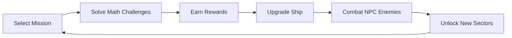
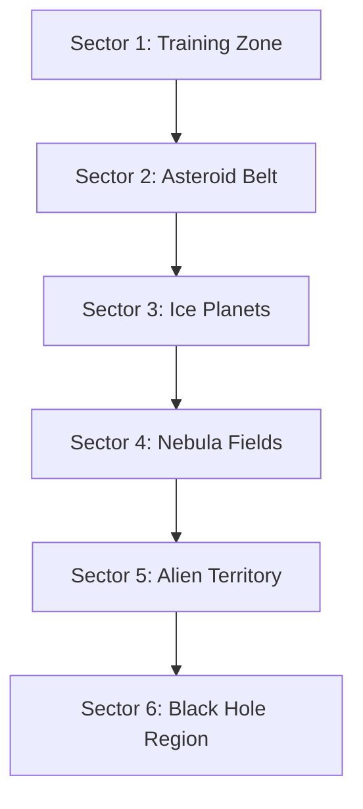

# Game Design Document: Space Math Academy

## Executive Summary

**Game Title:** Space Math Academy (working title)

**Target Audience:** Children ages 6-12

**Platform:** Web Browser (Desktop & Tablet)

**Genre:** Educational Space Adventure / RPG Lite

**Core Concept:** Players pilot a customizable spaceship through the galaxy, completing missions that require solving math challenges. Success rewards players with ship modules, weapons, and upgrades that enable them to defeat NPC enemies and progress through increasingly challenging sectors of space.

---

## 1. Game Overview

### 1.1 Vision Statement
Space Math Academy transforms math learning into an exciting space exploration adventure where every problem solved brings tangible rewards and progression. Players become space captains who must use their mathematical skills to upgrade their ship, defeat enemies, and unlock new regions of the galaxy.

### 1.2 Core Gameplay Loop

### 1.3 Key Features
- **Progressive Math Curriculum**: Adaptive difficulty that grows with player skill
- **Ship Customization**: Modular upgrade system for weapons, shields, engines, and utilities
- **Mission-Based Progression**: Structured challenges with clear objectives
- **NPC Combat System**: Turn-based or real-time combat using equipped modules
- **Exploration**: Multiple sectors/zones with unique themes and challenges
- **Reward System**: Immediate feedback and tangible progression

---

## 2. Game Mechanics

### 2.1 Mission System

#### Mission Types
1. **Training Missions** (Tutorial)
   - Introduction to basic controls
   - Simple math problems (addition, subtraction)
   - Rewards: Basic ship modules

2. **Exploration Missions**
   - Navigate to specific coordinates
   - Solve math problems to scan planets/asteroids
   - Rewards: Resources, ship parts, intel

3. **Rescue Missions**
   - Save stranded ships by solving math challenges
   - Rewards: Module unlocks, badges

4. **Boss Missions**
   - Multi-stage challenges requiring various math skills
   - Rewards: Sector unlocks, special badges/achievements for defeating specific bosses

#### Mission Structure
- **Objective**: Clear goal (e.g., "Solve 10 multiplication problems")
- **Difficulty Rating**: Stars (★☆☆ to ★★★★★)
- **Math Focus**: Specific skill area (addition, multiplication, fractions, etc.)
- **Rewards Preview**: Shows what modules or content player can unlock

### 2.2 Math Challenge System

#### Two-Dimensional Difficulty System

**Dimension 1: Math Skill** (determines which module is unlocked)
- Addition
- Subtraction
- Multiplication
- Division
- Fractions
- Decimals
- Algebra basics

**Dimension 2: Difficulty Level** (determines module power/level)
- **Level 1**: Small numbers (e.g., single-digit)
- **Level 2**: Medium numbers (e.g., double-digit)
- **Level 3**: Large numbers (e.g., triple-digit or complex operations)
- **Level 4**: Very large numbers or multi-step problems
- **Level 5**: Expert level challenges

Example: Completing "Multiplication - Level 3" unlocks a Level 3 Laser Cannon (multiplication weapon)

#### Challenge Presentation
- **Visual Context**: Math problems integrated into space scenarios
  - "Calculate fuel needed to reach planet X"
  - "How many asteroids in this field?" (counting/multiplication)
  - "Distribute shields evenly across 4 sections" (division)
- **Multiple Choice**: For younger players
- **Free Input**: For older/advanced players
- **Hints System**: Costs in-game currency but provides guidance

#### Player-Controlled Difficulty
- Players choose both the math skill and difficulty level for each mission
- Game encourages players to increase difficulty when they perform well (e.g., "You got 9/10 correct! Ready to try Level 3?")
- Game suggests trying easier difficulty or previous skills if player struggles (e.g., "That was tough! Want to practice Level 2 first?")
- No forced adjustments - player always has final choice
- Progress tracking shows performance by skill and difficulty to help inform choices

### 2.3 Ship Customization System

#### Ship Components

**1. Weapons** (Offensive modules - deal damage)
- **Laser Cannon**: Unlocked by Addition challenges
- **Missile Launcher**: Unlocked by Subtraction challenges
- **Plasma Beam**: Unlocked by Multiplication challenges
- **Ion Blaster**: Unlocked by Division challenges
- Each weapon has 5 power levels based on difficulty completed

**2. Support** (Defensive and utility modules)
- **Energy Shield**: Unlocked by Fraction challenges - blocks the next incoming attack, then needs recharging
- **Deflector Shield**: Unlocked by Decimal challenges - blocks the next incoming attack, then needs recharging
- **Nano-Repair**: Unlocked by mixed operation challenges - restores hull integrity
- **Reinforced Armor**: Unlocked by word problem challenges - increases total HP
- Each support module has 5 levels affecting effectiveness

#### Module Levels
- Modules come in 5 levels (1-5) based on difficulty of challenge completed
- Higher level modules are more powerful
- Visual changes to ship as better modules are equipped
- Players earn better modules by completing harder math challenges

### 2.4 Combat System

#### Combat Flow
1. **Encounter**: Player meets NPC enemy ship
2. **Combat Phase**: Turn-based combat begins
3. **Victory/Defeat**: Unlock new content or retry option

#### Combat Mechanics (Turn-Based)
- **Player Turn**:
  - **Action Phase**: Player can choose to use any module (Attack, Defend, Special) that has energy.
  - **Energy Cost**: Using a module consumes 1 energy point and ends the player's turn.
  - **Recharge Mechanic**:
    - If a module has 0 energy, the player can choose to **Recharge** it.
    - Recharging triggers a math problem (matching the skill/difficulty).
    - **Solve Correctly** → Specific module fully recharges.
    - **Turn Logic**: Recharging does **not** end the player's turn. The player can immediately use the recharged module (or another action).
    - **Limit**: Each module can only be recharged once per turn.
  
- **Enemy Turn**:
  - Enemy attacks based on their stats
  - Active shields block the attack
  - Armor reduces damage taken
  
- **Special Effects**:
  - Streaks of correct answers grant temporary bonuses (e.g., 3 correct in a row = bonus damage on next attack)
  - Powerful effects activate on longer streaks

#### Enemy Types
- **Space Pirates**: Balanced stats, common
- **Asteroid Drones**: Low health, high numbers
- **Alien Scouts**: Fast, evasive
- **Capital Ships**: High health, powerful attacks (boss-level)
- **Space Anomalies**: Unique mechanics, puzzle-like

### 2.5 Progression System

#### Sector Progression

Each sector:
- Unique visual theme
- Specific math focus areas
- New enemy types
- New modules to unlock
- Boss encounter that must be defeated to unlock next sector
- Special badge/achievement for defeating the sector boss

---

## 3. Reward System

### 3.1 Mission Rewards
- **Module Unlocks**: Completing a mission unlocks the corresponding module
  - Example: Complete "Addition - Level 3" mission → Unlock Level 3 Laser Cannon
- **Content Unlocks**: Some missions unlock new sectors, mission types, or enemy encounters
- **Boss Badges**: Defeating bosses grants special achievement badges

### 3.2 Progression Through Mastery
- Players progress by improving their math skills
- Better modules come from completing harder challenges
- No currency or resource grinding - pure skill-based progression
- Defeating bosses unlocks new sectors with new challenges

---

## 4. User Interface & Experience

### 4.1 Main Hub (Home Base)
- **Ship Bay**: View and customize ship with unlocked modules
- **Mission Board**: Select math skill, difficulty level, and launch missions
- **Hangar**: View collection of unlocked modules
- **Star Map**: Navigate between unlocked sectors
- **Profile**: Stats, badges, progress by math skill

### 4.2 Mission Interface
- **Problem Display**: Clear, large text
- **Answer Input**: Number pad or multiple choice
- **Progress Bar**: Shows mission completion (e.g., "5/10 problems solved")
- **Feedback**: Immediate visual feedback on correct/incorrect answers
- **Pause Menu**: Exit, settings

### 4.3 Combat Interface
- **Player Ship**: Health, shields, energy
- **Enemy Ship**: Health, shields
- **Math Problem**: Center focus
- **Action Buttons**: Attack, defend, special ability
- **Combat Log**: Recent actions

### 4.4 Visual Design Principles
- **Child-Friendly**: Bright colors, clear icons, no scary imagery
- **Space Theme**: Stars, planets, nebulas, spaceships
- **Feedback**: Animations for success/failure, level-ups
- **Accessibility**: Adjustable text size, colorblind modes

---

## 5. Educational Design

### 5.1 Math Curriculum Mapping

#### Grade 1-2 (Ages 6-7)
- Counting to 100
- Single-digit addition and subtraction
- Number recognition and ordering
- Basic shapes and patterns

#### Grade 3-4 (Ages 8-9)
- Multi-digit addition and subtraction
- Multiplication tables (1-12)
- Basic division
- Fractions (halves, quarters)
- Simple word problems

#### Grade 5-6 (Ages 10-11)
- Multi-digit multiplication and division
- Decimals and percentages
- Fraction operations
- Basic algebra (solving for x)
- Geometry (area, perimeter)

#### Grade 7+ (Ages 12+)
- Advanced algebra
- Ratios and proportions
- Negative numbers
- Order of operations
- Pre-algebra concepts

### 5.2 Learning Principles

**Spaced Repetition**
- Previously mastered concepts appear periodically
- Prevents skill decay
- Builds long-term retention

**Immediate Feedback**
- Correct answers: Positive reinforcement, rewards
- Incorrect answers: Show correct solution, offer retry
- No punishment, only learning opportunities

**Scaffolding**
- New concepts introduced gradually
- Build on previously mastered skills
- Provide support that fades as mastery increases

**Intrinsic Motivation**
- Progress is visible and meaningful
- Rewards are immediately useful
- Player agency in choosing missions

---

## 6. Technical Considerations

### 6.1 Platform Requirements
- **Browser Compatibility**: Chrome, Firefox, Safari, Edge (latest versions)
- **Responsive Design**: Desktop (1024px+) and tablet (768px+)
- **Performance**: Smooth 60fps animations
- **Save System**: Cloud-based progress saving (account required)
- **Offline Mode**: Optional offline play with sync when online

### 6.2 Technology Stack
- **Frontend**: HTML5, CSS3, TypeScript
- **Framework**: React, Vue, or vanilla TypeScript
- **Graphics**: Simple CSS animations and SVG for ship/combat visuals (no Canvas/WebGL needed initially)
- **Backend**: Node.js with database for user accounts
- **Database**: PostgreSQL or MongoDB for user data
- **Authentication**: OAuth or simple email/password

### 6.3 Data Storage
- **User Profile**: Username, current sector
- **Inventory**: Unlocked modules and their levels
- **Progress**: Completed missions, unlocked sectors, earned badges
- **Statistics**: Problems solved by math skill and difficulty, accuracy rates
- **Settings**: Audio, visual preferences

---

## 7. Content Roadmap

### 7.1 Initial Prototype
- **1 sector** (Training Zone)
- **5 missions** covering different math skills:
  - Mission 1: Addition (unlocks Laser Cannon)
  - Mission 2: Subtraction (unlocks Missile Launcher)
  - Mission 3: Multiplication (unlocks Plasma Beam)
  - Mission 4: Division (unlocks Ion Blaster)
  - Mission 5: Boss Battle (unlocks Sector 2)
- **6 modules**: 3 weapons + 3 support modules
- **2 module types**: Weapon and Support (simplified for young children)
- **2-3 enemy types**: Basic enemies + 1 boss
- **Turn-based combat** with recharge mechanics
- **Simple ship customization**: Equip unlocked modules

### 7.2 Version 1.0 (Full Release)
- 4-5 sectors with 40+ missions
- 8-10 enemy types including bosses
- 40+ modules across all categories
- Full combat system with special abilities
- Comprehensive math curriculum (grades 1-6)
- Achievement system
- Shop and economy

### 7.3 Future Expansions
- **New Sectors**: Additional regions with unique themes
- **Multiplayer**: Co-op missions, friendly competitions
- **Science Expansion**: Physics, chemistry challenges
- **Story Mode**: Narrative-driven campaign
- **Custom Missions**: Parent/teacher created challenges
- **Mobile App**: Native iOS/Android versions

---

## 8. Monetization Strategy (If Open Source)

### 8.1 Free & Open Source Model
- Core game completely free
- Open source code on GitHub
- Community contributions welcome
- Optional donation system

### 8.2 Optional Premium Features
- **Cosmetic Items**: Ship skins, decals (small fee)
- **Expansion Packs**: Additional sectors/content
- **Ad-Free Experience**: Remove optional ads
- **Early Access**: New features before public release

### 8.3 Educational Licensing
- Free for personal use
- Paid licensing for schools/institutions
- Bulk accounts with teacher dashboard

---

## 9. Success Metrics

### 9.1 Engagement Metrics
- Daily/weekly active users
- Average session length
- Mission completion rates
- Return player rate

### 9.2 Educational Metrics
- Problems solved per session
- Accuracy rates by math category
- Skill improvement over time
- Difficulty progression speed

### 9.3 Retention Metrics
- 7-day retention rate
- 30-day retention rate
- Churn rate and reasons

---

## 10. Risk Assessment & Mitigation

### 10.1 Potential Challenges

**Challenge**: Balancing fun and education
- **Risk**: Too educational = boring, too fun = not learning
- **Mitigation**: Extensive playtesting with target age group, iterate based on feedback

**Challenge**: Difficulty scaling
- **Risk**: Too easy = boredom, too hard = frustration
- **Mitigation**: Adaptive difficulty system, multiple difficulty modes

**Challenge**: Content creation
- **Risk**: Need large volume of quality math problems
- **Mitigation**: Problem generation algorithms, community contributions

**Challenge**: Technical complexity
- **Risk**: Complex features may delay launch
- **Mitigation**: Start with MVP, iterate with additional features

**Challenge**: Accessibility
- **Risk**: Not all children have same learning needs
- **Mitigation**: Accessibility options, adjustable difficulty, hint system

---

## 11. Next Steps

### 11.1 Pre-Development
1. **Validate Concept**: Test with your kids, gather feedback
2. **Create Prototype**: Simple playable version of core loop
3. **Art Style**: Define visual direction, create mood board
4. **Math Content**: Compile initial problem sets
5. **Technical Planning**: Choose tech stack, set up development environment

### 11.2 Development Phases

**Phase 1: Foundation (Weeks 1-4)**
- Basic UI/UX framework
- Mission selection and math challenge system
- Simple reward mechanism
- Core data structures

**Phase 2: Core Gameplay (Weeks 5-8)**
- Ship customization system
- Module implementation
- Combat system (basic version)
- First 2 sectors with missions

**Phase 3: Polish & Content (Weeks 9-12)**
- Additional missions and enemies
- Visual polish and animations
- Sound effects and music
- Achievement system
- Bug fixes and optimization

**Phase 4: Testing & Launch (Weeks 13-16)**
- Extensive playtesting
- Balance adjustments
- Performance optimization
- Documentation
- Public release

---

## 12. Appendix

### 12.1 Glossary
- **Module**: Upgradeable ship component (weapon, shield, utility)
- **Sector**: Major region of space with multiple missions
- **Mission**: Discrete challenge with math problems and rewards
- **NPC**: Non-player character (enemy ships)
- **XP**: Experience points for player progression

### 12.2 References & Inspiration
- **Educational Games**: Prodigy Math, DragonBox, Math Blaster
- **Space Games**: FTL, Star Traders, Space Engineers
- **Progression Systems**: RPG mechanics, roguelike elements

### 12.3 Contact & Contribution
- Project repository: [To be created]
- Issue tracker: [To be created]
- Community forum: [To be created]

---

**Document Version**: 1.0  
**Last Updated**: 2025-11-26  
**Author**: Seyit Ivhed  
**Status**: Initial Draft
