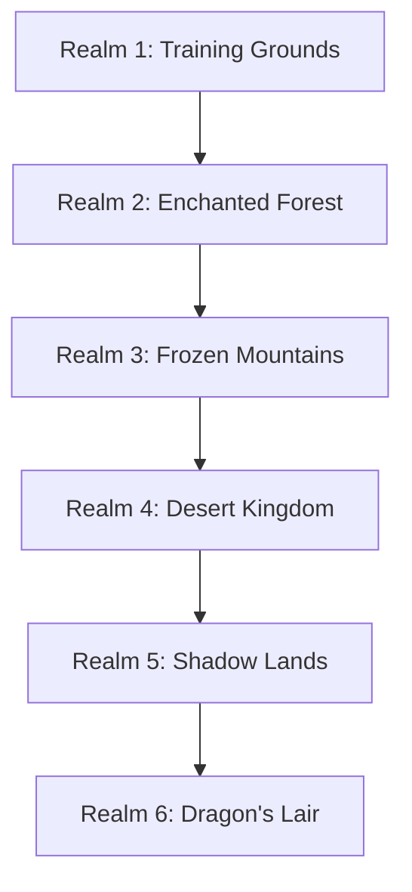

# Game Design Document: Math Quest Adventures

## Executive Summary

**Game Title:** Math Quest Adventures (working title)

**Target Audience:** Children ages 6-12

**Platform:** Web Browser (Desktop & Tablet)

**Genre:** Educational Fantasy Adventure / RPG Lite

**Core Concept:** Players become the leader of an adventuring party on an epic journey through magical realms. As they progress, new companions join their party and existing companions grow stronger. Players help their companions overcome challenges (which cleverly integrate math skills) to defeat monsters, complete adventures, and unlock new regions. The party grows from a small band to a formidable fellowship of heroes.

---

### 1. Game Overview

### 1.1 Vision Statement
Math Quest Adventures transforms math learning into an exciting fantasy journey where every challenge overcome makes your party stronger. Players lead their own fellowship, helping companions solve contextual challenges (naturally integrated math) to grow in power, defeat monsters, and unlock new regions of the realm.

### 1.2 Core Gameplay Loop

### 1.3 Key Features
- **Progressive Math Curriculum**: Adaptive difficulty that grows with player skill
- **Companion Collection**: Recruit diverse heroes, each with unique abilities
- **Party Customization**: Choose 4 companions to take on encounters
- **Upgrade System**: Direct companion upgrades - no equipment micromanagement
- **Adventure-Based Progression**: Structured challenges with clear objectives
- **Monster Encounter System**: Turn-based battles using companion abilities
- **Exploration**: Multiple realms with unique themes and challenges
- **Reward System**: Immediate feedback and tangible progression

---

## 2. Game Mechanics

### 2.1 Adventure System

#### Adventure Types
1. **Training Adventures** (Tutorial)
   - Introduction to basic controls
   - Simple math problems (addition, subtraction)
   - Rewards: First companions, basic upgrades

2. **Exploration Adventures**
   - Discover hidden locations
   - Solve math problems to find treasures
   - Rewards: Experience, companion unlocks, resources

3. **Rescue Adventures**
   - Save villagers by solving math challenges
   - Rewards: Companion unlocks, badges

4. **Boss Adventures**
   - Multi-stage challenges requiring various math skills
   - Rewards: Realm unlocks, special badges for defeating bosses

#### Adventure Structure
- **Objective**: Story-driven goal (e.g., "Help villagers count their harvest" or "Divide treasure among the party")
- **Difficulty Rating**: Stars (★☆☆ to ★★★★★)
- **Skill Focus**: Hidden math skill practiced (addition, multiplication, fractions, etc.)
- **Rewards Preview**: Shows what companions or upgrades player can unlock

### 2.2 Math Challenge System

#### Two-Dimensional Difficulty System

**Dimension 1: Math Skill** (determines which companion skill is enhanced)
- Addition
- Subtraction
- Multiplication
- Division
- Fractions
- Decimals
- Algebra basics

**Dimension 2: Difficulty Level** (determines companion upgrade level)
- **Level 1**: Small numbers (e.g., single-digit)
- **Level 2**: Medium numbers (e.g., double-digit)
- **Level 3**: Large numbers (e.g., triple-digit or complex operations)
- **Level 4**: Very large numbers or multi-step problems
- **Level 5**: Expert level challenges

Example: Completing "Multiplication - Level 3" unlocks or upgrades a companion's attack ability to Level 3

#### Challenge Presentation
- **Contextual Integration**: Math naturally woven into story scenarios (never explicit "math problems")
  - "The merchant needs 7 potions but only has 3. How many more should we buy?"
  - "There are goblins hiding behind rocks. Count them before they attack!"
  - "We found 24 gold coins. Split them fairly among your 4 companions."
  - "The bridge can hold 50 people. We have 32. How many more allies can cross?"
- **Multiple Choice**: For younger players
- **Free Input**: For older/advanced players  
- **Hints System**: Companion dialogue provides guidance (costs in-game currency)

#### Player-Controlled Difficulty
- Players choose both the math skill and difficulty level for each adventure
- Game encourages players to increase difficulty when they perform well (e.g., "You got 9/10 correct! Ready to try Level 3?")
- Game suggests trying easier difficulty or previous skills if player struggles (e.g., "That was tough! Want to practice Level 2 first?")
- No forced adjustments - player always has final choice
- Progress tracking shows performance by skill and difficulty to help inform choices

### 2.3 Companion System

#### Core Design Philosophy
- **Permanent Companions**: Once unlocked, companions are yours forever
- **No Equipment**: Companions upgrade directly (simpler for children)
- **Party Selection**: Choose which 4 companions to bring on each adventure
- **Diverse Heroes**: Each companion has unique personality, appearance, and role

#### Companion Roles & Abilities

**Warrior Companions** (Offensive - Deal Damage)
- **Fire Knight**: Unlocked by Addition challenges
  - **Single Ability**: Flame Strike - high damage attack
  - Personality: Brave and enthusiastic
  - Visual: Red armor, flaming sword

- **Shadow Archer**: Unlocked by Subtraction challenges
  - **Single Ability**: Shadow Arrow - piercing damage
  - Personality: Calm and precise
  - Visual: Dark green cloak, silver bow

- **Lightning Mage**: Unlocked by Multiplication challenges
  - **Single Ability**: Thunder Bolt - explosive damage
  - Personality: Energetic and curious
  - Visual: Purple robes, crackling staff

- **Frost Ranger**: Unlocked by Division challenges
  - **Single Ability**: Ice Arrow - damage with slow effect
  - Personality: Cool and strategic
  - Visual: Blue outfit, frost-tipped arrows

**Guardian Companions** (Defensive - Protect Party)
- **Crystal Guardian**: Unlocked by Fraction challenges
  - **Single Ability**: Crystal Shield - blocks the next incoming attack
  - Personality: Gentle and protective
  - Visual: Translucent crystal armor, glowing shield

- **Earth Defender**: Unlocked by Decimal challenges
  - **Single Ability**: Stone Barrier - blocks the next incoming attack
  - Personality: Steadfast and reliable
  - Visual: Brown/green stone armor

**Support Companions** (Healing & Utility)
- **Light Healer**: Unlocked by mixed operation challenges
  - **Single Ability**: Healing Light - restores party health
  - Personality: Kind and compassionate
  - Visual: White/gold robes, healing staff

- **Nature Druid**: Unlocked by word problem challenges
  - **Single Ability**: Nature's Blessing - restores health over time
  - Personality: Wise and patient
  - Visual: Green robes, nature-themed staff

#### Companion Upgrade System
- Companions have **5 upgrade levels** (Level 1-5)
- Upgrades increase ability strength directly
  - Level 1 Fire Knight: Flame Strike deals 10 damage
  - Level 3 Fire Knight: Flame Strike deals 25 damage
  - Level 5 Fire Knight: Flame Strike deals 45 damage
- Visual changes as companions level up (better armor, glowing effects)
- Players earn upgrades by completing harder math challenges
- Simple progression: "Your Fire Knight is now Level 3!"

#### Companion Collection
- Start with 2 basic companions (e.g., Fire Knight + Light Healer)
- Unlock new companions through adventures and progression
- Initially can have up to 4 total companions, expand to 8+ as you progress
- Benched companions "rest at the Camp" (not abandoned!)
- Strategic choice: Which 4 to bring for this specific adventure?

### 2.4 Encounter System

#### Encounter Flow
1. **Meeting**: Player meets monster or monster group
2. **Action Phase**: Turn-based encounter begins
3. **Victory/Defeat**: Unlock new content or retry option

#### Encounter Mechanics (Turn-Based)
- **Player Turn**:
  - **Action Phase**: Player chooses one of their 4 companions to act (each companion has their single unique ability).
  - **Energy Cost**: Using a companion's ability consumes 1 energy point and ends the player's turn.
  - **Recharge Mechanic**:
    - If a companion has 0 energy, the player can choose to **Recharge** them.
    - Recharging presents a contextual math challenge.
    - **Solve Correctly**: Companion gains 1 Energy (or full charge) immediately.
    - **Solve Incorrectly**: The recharge Fails. The companion remains at 0 energy. The player **cannot** try again this turn; they must wait until the next turn to attempt recharge again.
    - Example: "The Fire Knight needs to calibrate his aim! Solve 12 - 4."

  - **Special Attack Meter (The "Limit Break")**:
    - A shared "Party Meter" fills up as companions successfully use abilities or defeat enemies.
    - When the meter is **Full**, a "Special Attack" button becomes available.
    - Clicking it triggers a **Helper/Boss Level Math Problem** (slightly harder challenge).
    - **Solve Correctly**: Unleashes a powerful effect (e.g., Heal All, Massive Damage to All Enemies).
    - **Solve Incorrectly**: The attack **Fails** and the **Meter Drains completely** to 0. The player must refill the meter to try again.
    - This creates a high-stakes "moment of truth" rewarding mastery.
  
- **Monster Turn**:
  - Monster attacks based on their stats
  - Active shields block the attack
  - Armor reduces damage taken
  
- **Special Effects**:
  - Streaks of correct answers grant temporary bonuses (e.g., 3 correct in a row = bonus damage on next attack)
  - Powerful effects activate on longer streaks

#### Monster Types
- **Forest Goblins**: Balanced stats, common
- **Stone Golems**: Low health, high numbers
- **Shadow Spirits**: Fast, evasive
- **Dragon Bosses**: High health, powerful attacks (boss-level)
- **Magical Anomalies**: Unique mechanics, puzzle-like

### 2.5 Progression System

#### Realm Progression

Each realm:
- Unique visual theme
- Specific math focus areas
- New monster types
- New companions to unlock
- Boss encounter that must be defeated to unlock next realm
- Special badge/achievement for defeating the realm boss

---

## 3. Reward System

### 3.1 Adventure Rewards
- **Companion Unlocks**: Completing an adventure unlocks a new companion
  - Example: Complete "Addition - Level 1" adventure → Unlock Fire Knight (Level 1)
- **Companion Upgrades**: Completing adventures upgrades existing companions
  - Example: Complete "Addition - Level 3" adventure → Upgrade Fire Knight to Level 3
- **Content Unlocks**: Some adventures unlock new realms, adventure types, or monster encounters
- **Boss Badges**: Defeating bosses grants special achievement badges

### 3.2 Progression Through Mastery
- Players progress by improving their math skills
- Stronger companions come from completing harder challenges
- No currency or resource grinding - pure skill-based progression
- Defeating bosses unlocks new realms with new challenges

---

## 4. User Interface & Experience

### 4.1 Main Hub (Camp / Fellowship Camp)
- **Party Circle**: View all unlocked companions gathered around the campfire
- **Party Setup**: Choose which 4 companions to bring on next adventure
- **Adventure Map**: Select next adventure and see available paths
- **Realm Map**: Navigate between unlocked realms
- **Journal**: Stats, badges, progress, companion stories

### 4.2 Quest Interface
- **Problem Display**: Clear, large text
- **Answer Input**: Number pad or multiple choice
- **Progress Bar**: Shows quest completion (e.g., "5/10 problems solved")
- **Feedback**: Immediate visual feedback on correct/incorrect answers
- **Pause Menu**: Exit, settings

### 4.3 Combat Interface
- **Your Party**: 4 companion portraits showing health and energy
- **Enemy**: Health and shields
- **Math Problem**: Center focus when recharging
- **Action Buttons**: Choose which companion ability to use
- **Combat Log**: Recent actions

### 4.4 Visual Design Principles
- **Child-Friendly**: Bright colors, clear icons, friendly characters
- **Fantasy Theme**: Castles, forests, magical effects, heroes and monsters
- **Feedback**: Animations for success/failure, level-ups
- **Accessibility**: Adjustable text size, colorblind modes
- **Character-Driven**: Companions have personality through dialogue and expressions

---

## 5. Educational Design

### 5.1 Math Curriculum Mapping

#### Grade 1-2 (Ages 6-7)
- Counting to 100
- Single-digit addition and subtraction
- Number recognition and ordering
- Basic shapes and patterns

#### Grade 3-4 (Ages 8-9)
- Multi-digit addition and subtraction
- Multiplication tables (1-12)
- Basic division
- Fractions (halves, quarters)
- Simple word problems

#### Grade 5-6 (Ages 10-11)
- Multi-digit multiplication and division
- Decimals and percentages
- Fraction operations
- Basic algebra (solving for x)
- Geometry (area, perimeter)

#### Grade 7+ (Ages 12+)
- Advanced algebra
- Ratios and proportions
- Negative numbers
- Order of operations
- Pre-algebra concepts

### 5.2 Learning Principles

**Spaced Repetition**
- Previously mastered concepts appear periodically
- Prevents skill decay
- Builds long-term retention

**Immediate Feedback**
- Correct answers: Positive reinforcement, rewards
- Incorrect answers: Show correct solution, offer retry
- No punishment, only learning opportunities

**Scaffolding**
- New concepts introduced gradually
- Build on previously mastered skills
- Provide support that fades as mastery increases

**Intrinsic Motivation**
- Progress is visible and meaningful
- Rewards are immediately useful
- Player agency in choosing quests
- Emotional connection to companions

---

## 6. Technical Considerations

### 6.1 Platform Requirements
- **Browser Compatibility**: Chrome, Firefox, Safari, Edge (latest versions)
- **Responsive Design**: Desktop (1024px+) and tablet (768px+)
- **Performance**: Smooth 60fps animations
- **Save System**: Cloud-based progress saving (account required)
- **Offline Mode**: Optional offline play with sync when online

### 6.2 Technology Stack
- **Frontend**: HTML5, CSS3, TypeScript
- **Framework**: React with TypeScript
- **State Management**: Zustand (already in use)
- **Routing**: React Router (already in use)
- **Internationalization**: i18next (already in use)
- **Testing**: Vitest for unit tests, Playwright for E2E (already in use)
- **Build Tool**: Vite (already in use)
- **Graphics**: CSS animations and SVG for companions/combat visuals
- **AI Art**: Stable Diffusion or similar for companion portraits and backgrounds

### 6.3 Data Storage
- **User Profile**: Username, current realm
- **Companion Collection**: Unlocked companions and their levels
- **Progress**: Completed quests, unlocked realms, earned badges
- **Statistics**: Problems solved by math skill and difficulty, accuracy rates
- **Settings**: Audio, visual preferences

### 6.4 Art Asset Requirements (AI-Generated)
- **Companion Portraits**: 8-12 unique character portraits (multiple levels each)
- **Enemy Designs**: 6-10 enemy/monster designs
- **Background Scenes**: 6 realm backgrounds (forest, mountains, desert, etc.)
- **UI Elements**: Buttons, frames, decorative elements
- **Ability Effects**: Visual effects for attacks, shields, healing

---

## 7. Content Roadmap

### 7.1 Initial Prototype
- **1 realm** (Training Grounds)
- **5 quests** covering different math skills:
  - Quest 1: Addition (unlocks Fire Knight)
  - Quest 2: Subtraction (unlocks Shadow Archer)
  - Quest 3: Multiplication (unlocks Lightning Mage)
  - Quest 4: Division (unlocks Frost Ranger)
  - Quest 5: Boss Battle (unlocks Realm 2)
- **6-8 companions**: Mix of warrior, guardian, and support classes
- **2-3 enemy types**: Basic enemies + 1 boss
- **Turn-based combat** with recharge mechanics
- **Simple party selection**: Choose 4 companions before each quest

### 7.2 Version 1.0 (Full Release)
- 4-5 realms with 40+ quests
- 8-10 enemy types including bosses
- 12+ companions across all classes
- Full combat system with special abilities
- Comprehensive math curriculum (grades 1-6)
- Achievement system
- Companion dialogue and personality

### 7.3 Future Expansions
- **New Realms**: Additional regions with unique themes
- **More Companions**: Exotic classes (ninja, pirate, dragon rider)
- **Multiplayer**: Co-op quests, friendly competitions
- **Science Expansion**: Science-based quests
- **Story Mode**: Narrative-driven campaign with companion backstories
- **Custom Quests**: Parent/teacher created challenges
- **Mobile App**: Native iOS/Android versions

---

## 8. Monetization Strategy (If Open Source)

### 8.1 Free & Open Source Model
- Core game completely free
- Open source code on GitHub
- Community contributions welcome
- Optional donation system

### 8.2 Optional Premium Features
- **Cosmetic Items**: Companion skins, special effects (small fee)
- **Expansion Packs**: Additional realms/companions
- **Ad-Free Experience**: Remove optional ads
- **Early Access**: New features before public release

### 8.3 Educational Licensing
- Free for personal use
- Paid licensing for schools/institutions
- Bulk accounts with teacher dashboard

---

## 9. Success Metrics

### 9.1 Engagement Metrics
- Daily/weekly active users
- Average session length
- Quest completion rates
- Return player rate
- Companion attachment (which are most used)

### 9.2 Educational Metrics
- Problems solved per session
- Accuracy rates by math category
- Skill improvement over time
- Difficulty progression speed

### 9.3 Retention Metrics
- 7-day retention rate
- 30-day retention rate
- Churn rate and reasons

---

## 10. Risk Assessment & Mitigation

### 10.1 Potential Challenges

**Challenge**: Balancing fun and education
- **Risk**: Too educational = boring, too fun = not learning
- **Mitigation**: Extensive playtesting with target age group, iterate based on feedback

**Challenge**: Difficulty scaling
- **Risk**: Too easy = boredom, too hard = frustration
- **Mitigation**: Adaptive difficulty system, multiple difficulty modes

**Challenge**: Content creation
- **Risk**: Need large volume of quality math problems
- **Mitigation**: Problem generation algorithms, community contributions

**Challenge**: Technical complexity
- **Risk**: Complex features may delay launch
- **Mitigation**: Start with MVP, iterate with additional features

**Challenge**: Accessibility
- **Risk**: Not all children have same learning needs
- **Mitigation**: Accessibility options, adjustable difficulty, hint system

**Challenge**: AI Art Consistency
- **Risk**: AI-generated art may lack cohesive style
- **Mitigation**: Develop clear style guide, use same prompts/models, manual curation

---

## 11. Next Steps

### 11.1 Pre-Development
1. **Validate Concept**: Test fantasy theme with target audience (your kids!)
2. **Create Prototype**: Simple playable version of core loop
3. **AI Art Tests**: Generate companion portraits to establish visual style
4. **Define Companions**: Finalize 6-8 core companions with personalities
5. **Math Content**: Compile initial problem sets
6. **Technical Planning**: Adapt existing codebase for fantasy theme

### 11.2 Development Phases

**Phase 1: Foundation (Weeks 1-4)**
- Convert UI/UX from space to fantasy theme
- Rename and restructure: Ship → Guild Hall, Modules → Companions
- Quest selection and math challenge system (minimal changes)
- Core data structures for companions

**Phase 2: Core Gameplay (Weeks 5-8)**
- Companion collection and upgrade system
- Party selection interface (choose 4 before quest)
- Combat system adaptation for companions
- First 2 realms with quests
- AI art generation and integration

**Phase 3: Polish & Content (Weeks 9-12)**
- Additional quests and enemies
- Visual polish and animations
- Sound effects and music (fantasy-themed)
- Companion dialogue and personality
- Achievement system
- Bug fixes and optimization

**Phase 4: Testing & Launch (Weeks 13-16)**
- Extensive playtesting with children
- Balance adjustments
- Performance optimization
- Documentation
- Public release

---

## 12. Appendix

### 12.1 Glossary
- **Companion**: Hero who joins your adventuring party, each with one unique ability
- **Party Camp**: Main hub where companions gather and player prepares for adventures
- **Realm**: Major region with multiple quests
- **Quest/Adventure**: Story-driven challenge with contextual math integration
- **Upgrade**: Improving a companion's level (1-5)
- **Party**: The 4 companions chosen for a specific adventure
- **Adventuring Party**: Your full collection of companions (only 4 active at a time)

### 12.2 References & Inspiration
- **Educational Games**: Prodigy Math, DragonBox, Math Blaster
- **Fantasy Games**: Pokémon, Ni no Kuni, Final Fantasy tactics
- **Party Systems**: Dragon Quest, classic JRPGs
- **Character Design**: Avatar: The Last Airbender, How to Train Your Dragon

### 12.3 Companion Design Guidelines (AI Generation)
- **Diversity**: Varied ethnicities, genders, ages
- **Visual Clarity**: Clear silhouettes, distinct color palettes
- **Age-Appropriate**: Friendly, heroic, not scary
- **Personality Through Design**: Expressions, poses reflect character
- **Consistency**: Same art style across all companions

### 12.4 Contact & Contribution
- Project repository: [To be created]
- Issue tracker: [To be created]
- Community forum: [To be created]

---

**Document Version**: 2.0 (Fantasy Theme Revision)  
**Last Updated**: 2025-12-07  
**Author**: Seyit Ivhed  
**Status**: Design Revision - Pending Implementation
