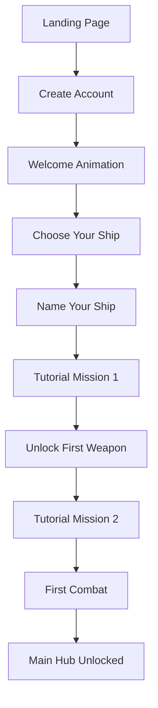
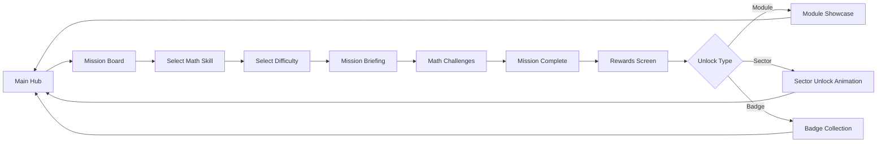
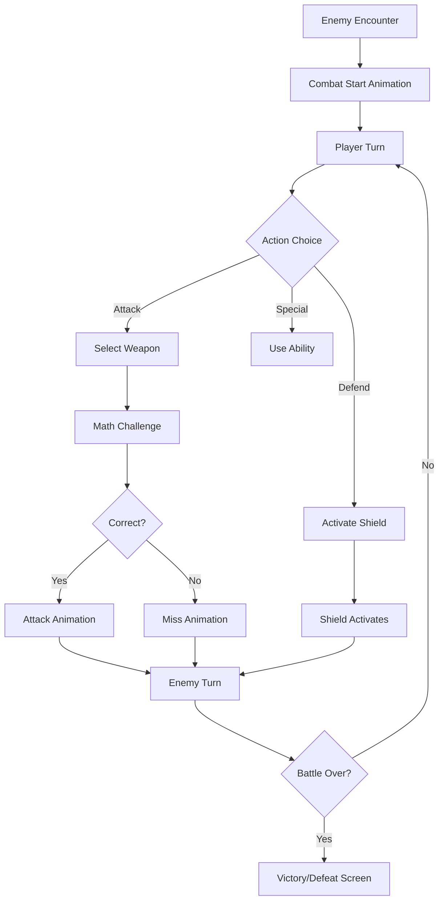
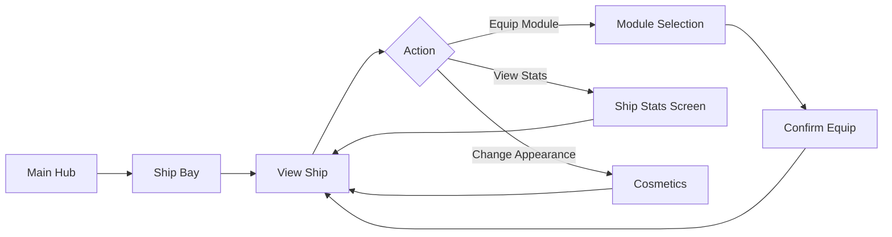

# UX/UI Design Document: Space Math Academy

## Table of Contents
1. [Design Philosophy](#1-design-philosophy)
2. [User Flows](#2-user-flows)
3. [Screen Layouts](#3-screen-layouts)
4. [Visual Design System](#4-visual-design-system)
5. [Component Library](#5-component-library)
6. [Interaction Patterns](#6-interaction-patterns)
7. [Responsive Design](#7-responsive-design)
8. [Accessibility](#8-accessibility)
9. [Animation & Feedback](#9-animation--feedback)
10. [Implementation Guidelines](#10-implementation-guidelines)

---

## 1. Design Philosophy

### 1.1 Core Principles

**Clarity Over Complexity**
- Every screen should have one primary action
- Information hierarchy guides the eye naturally
- No clutter - every element serves a purpose

**Delight Through Discovery**
- Subtle animations reward interactions
- Easter eggs and hidden details encourage exploration
- Progress is visually celebrated

**Empowerment Through Choice**
- Players always know what they're choosing
- Consequences are clear before commitment
- Easy to undo or go back

**Accessibility First**
- Readable by default (large text, high contrast)
- Multiple ways to accomplish tasks
- No time pressure on decisions

### 1.2 Target Audience Considerations

**Ages 6-7 (Early Elementary)**
- Larger touch targets (minimum 60px)
- Heavy use of icons with text labels
- Bright, distinct colors
- Simple vocabulary
- Audio support for text

**Ages 8-10 (Middle Elementary)**
- Standard touch targets (minimum 44px)
- Icons can be more abstract
- Can handle more information density
- Reading comprehension improving
- Less audio dependency

**Ages 11-12 (Upper Elementary)**
- Adult-sized touch targets acceptable
- Can understand complex interfaces
- Appreciates sophisticated design
- Wants to feel "grown up"

### 1.3 Emotional Goals

**Players Should Feel:**
- **Capable**: "I can do this!"
- **Curious**: "What's next?"
- **Proud**: "Look what I accomplished!"
- **Safe**: "It's okay to make mistakes"
- **In Control**: "I decide what to do"

---

## 2. User Flows

### 2.1 First-Time User Experience (FTUE)



**Key Moments:**
1. **Landing**: Exciting space animation, clear "Start Adventure" button
2. **Account Creation**: Simple, quick (email optional, can use username)
3. **Welcome**: Brief animated sequence showing the galaxy
4. **Ship Selection**: Choose from 3 starter ship designs (cosmetic only)
5. **Naming**: Personalize the ship (with suggestions if stuck)
6. **Tutorial**: Gentle introduction to math challenges
7. **First Unlock**: Celebration animation for first weapon
8. **Combat Tutorial**: Guided first battle
9. **Hub Access**: Full game unlocked

### 2.2 Core Gameplay Loop Flow



### 2.3 Combat Flow



### 2.4 Ship Customization Flow



---

## 3. Screen Layouts

### 3.1 Main Hub (Home Base)

**Layout Structure:**
```
┌─────────────────────────────────────────────────────┐
│  [Logo]              SPACE MATH ACADEMY    [Profile]│
├─────────────────────────────────────────────────────┤
│                                                     │
│              ┌─────────────────┐                   │
│              │                 │                   │
│              │   YOUR SHIP     │                   │
│              │   (Animated)    │                   │
│              │                 │                   │
│              └─────────────────┘                   │
│                                                     │
│  ┌──────────┐  ┌──────────┐  ┌──────────┐        │
│  │ MISSION  │  │   SHIP   │  │   STAR   │        │
│  │  BOARD   │  │   BAY    │  │   MAP    │        │
│  │  [Icon]  │  │  [Icon]  │  │  [Icon]  │        │
│  └──────────┘  └──────────┘  └──────────┘        │
│                                                     │
│  ┌──────────┐  ┌──────────┐                       │
│  │ HANGAR   │  │ PROFILE  │                       │
│  │  [Icon]  │  │  [Icon]  │                       │
│  └──────────┘  └──────────┘                       │
│                                                     │
├─────────────────────────────────────────────────────┤
│  Current Sector: Training Zone          [Settings] │
└─────────────────────────────────────────────────────┘
```

**Key Elements:**
- **Header**: Persistent navigation, profile access
- **Ship Display**: Central focus, animated idle state
- **Navigation Cards**: Large, icon-driven buttons to main areas
- **Footer**: Context info, settings access

**Interaction:**
- Hover effects on navigation cards (glow, slight lift)
- Ship rotates slowly, thrusters pulse
- Clicking ship opens Ship Bay
- Background: Animated starfield

### 3.2 Mission Board

**Layout Structure:**
```
┌─────────────────────────────────────────────────────┐
│  [← Back]           MISSION BOARD                   │
├─────────────────────────────────────────────────────┤
│                                                     │
│  SELECT MATH SKILL:                                │
│  ┌────────┐ ┌────────┐ ┌────────┐ ┌────────┐     │
│  │   +    │ │   -    │ │   ×    │ │   ÷    │     │
│  │ Add    │ │ Subtract│ │Multiply│ │ Divide │     │
│  └────────┘ └────────┘ └────────┘ └────────┘     │
│  ┌────────┐ ┌────────┐ ┌────────┐                │
│  │  ½     │ │  0.5   │ │  x+2   │                │
│  │Fraction│ │Decimal │ │Algebra │                │
│  └────────┘ └────────┘ └────────┘                │
│                                                     │
│  SELECT DIFFICULTY:                                │
│  ┌────────┐ ┌────────┐ ┌────────┐ ┌────────┐     │
│  │   ★    │ │  ★★    │ │  ★★★   │ │ ★★★★   │     │
│  │Level 1 │ │Level 2 │ │Level 3 │ │Level 4 │     │
│  └────────┘ └────────┘ └────────┘ └────────┘     │
│                                                     │
│  ┌─────────────────────────────────────────┐      │
│  │ MISSION PREVIEW                         │      │
│  │                                         │      │
│  │ Skill: Multiplication                  │      │
│  │ Difficulty: ★★★ (Level 3)              │      │
│  │ Problems: 10                            │      │
│  │                                         │      │
│  │ Reward: Level 3 Plasma Beam            │      │
│  │ [Image of Plasma Beam]                 │      │
│  │                                         │      │
│  │         [LAUNCH MISSION]                │      │
│  └─────────────────────────────────────────┘      │
│                                                     │
└─────────────────────────────────────────────────────┘
```

**Key Elements:**
- **Skill Selection**: Grid of math skill cards
- **Difficulty Selection**: Star-rated difficulty levels
- **Mission Preview**: Shows what you'll do and earn
- **Launch Button**: Large, prominent, disabled until selections made

**Interaction:**
- Selected skill/difficulty highlighted with border glow
- Preview updates in real-time as selections change
- Locked skills/difficulties shown with lock icon and "Complete X to unlock"
- Hover shows additional info (e.g., "Best Score: 9/10")

### 3.3 Navigation Challenge (Exploration Mode)

*Replaces static problem solving with active gameplay*

**Layout Structure:**
```
┌─────────────────────────────────────────────────────┐
│  [||] Pause    SCORE: 1250    MULTIPLIER: x2       │
├─────────────────────────────────────────────────────┤
│                                                     │
│            Current Vector:  8 × 7                   │
│           ┌───────────────────────┐                 │
│           │      PROBLEM HUD      │                 │
│           └───────────────────────┘                 │
│                                                     │
│         (Space View - Ship Flying Forward)          │
│                                                     │
│      [54]           [56]           [64]             │
│    Asteroid       Warp Gate      Nebula             │
│     (Left)        (Center)       (Right)            │
│                                                     │
│                      ▲                              │
│                     [▲]                             │
│                  YOUR SHIP                          │
│                                                     │
│                                                     │
│  [< Steer Left]                  [Steer Right >]    │
│                                                     │
└─────────────────────────────────────────────────────┘
```

**Concept: "The Gauntlet"**
Instead of stopping to solve a problem, the player flies their ship through space. Math answers appear as physical objects or gates in the world.

**Key Elements:**
- **Heads-Up Display (HUD)**: Shows the current math problem at the top (e.g., "Calculate Warp Vector").
- **Lanes**: The screen is divided into 3 flyable lanes.
- **Answer Objects**: Approaching objects (Asteroids, Gates, Fuel Cells) are labeled with numbers.
- **The Ship**: Player controls lateral movement (Left/Right).

**Interaction:**
- **Continuous Flow**: The ship is always moving forward.
- **Decision Making**: Player sees the problem "8 × 7" and must steer into the "56" gate.
- **Visual Feedback**:
  - **Correct (Gate)**: Ship boosts speed, screen warps slightly, "Smooth Sailing" sound.
  - **Incorrect (Asteroid)**: Ship takes shield damage, camera shakes, speed decreases.
- **Input**: Arrow keys or swipe gestures to change lanes.

### 3.4 Combat Screen (Tactical Cockpit)

*Replaces turn-based form filling with immersive ship management*

**Layout Structure:**
```
┌─────────────────────────────────────────────────────┐
│  [Enemy: Pirate Scout]       [Shields: 100%]        │
├─────────────────────────────────────────────────────┤
│                                                     │
│        (Cinematic View of Enemy Ship Moving)        │
│                                                     │
│      ┌───────────┐                 ┌───────────┐    │
│      │  TARGET   │                 │ INCOMING! │    │
│      │  LOCKED   │                 │  MISSILE  │    │
│      │           │                 │           │    │
│      │  12 + 9   │                 │  10 - 4   │    │
│      │           │                 │           │    │
│      │   [21]    │                 │    [?]    │    │
│      └─────┬─────┘                 └─────┬─────┘    │
│            │                             │          │
│      [LASER CHARGING]              [SHIELD STATUS]  │
│                                                     │
│                                                     │
│  ┌───────────────────────────────────────────────┐  │
│  │ DASHBOARD CONTROLS                            │  │
│  │ [1] [2] [3]  (Quick Answer Keypad)            │  │
│  │ [4] [5] [6]                                   │  │
│  └───────────────────────────────────────────────┘  │
│                                                     │
└─────────────────────────────────────────────────────┘
```

**Concept: "Active Systems Management"**
Math is the "fuel" that powers ship systems. The battle plays out in real-time (or active turn-based) in the main viewport.

**Key Elements:**
- **Main Viewport**: Cinematic view of the enemy ship attacking, dodging, or taking damage.
- **Holographic Overlays**: Math problems appear as semi-transparent projections near the systems they control (Weapons, Shields, Engines).
- **Dashboard**: The player's control panel at the bottom.

**Interaction:**
- **Offense (Charging Weapons)**:
  - To fire lasers, player selects the weapon.
  - A "Targeting Solution" problem appears (e.g., "12 + 9").
  - Solving it "locks on" and fires the weapon immediately.
  - *Game Feel*: "I'm hacking the targeting computer" rather than "I'm doing homework."
- **Defense (Active Shielding)**:
  - When enemy fires, an "Incoming Projectile" alert shows a problem.
  - Solving it quickly deploys a flare or shield to block that specific shot.
- **Pacing**:
  - Problems fade in gracefully near the relevant ship part.
  - Not a modal popup; the battle is still visible behind the numbers.
  - "Bullet Time" (slow motion) activates while the player is typing/selecting an answer to reduce anxiety but maintain intensity.

### 3.5 Ship Bay (Customization)

**Layout Structure:**
```
┌─────────────────────────────────────────────────────┐
│  [← Back]              SHIP BAY                     │
├─────────────────────────────────────────────────────┤
│                                                     │
│  ┌─────────────────────────────────────────────┐  │
│  │                                             │  │
│  │         [YOUR SHIP - 3D VIEW]               │  │
│  │                                             │  │
│  │         Rotatable, shows equipped           │  │
│  │         modules highlighted                 │  │
│  │                                             │  │
│  └─────────────────────────────────────────────┘  │
│                                                     │
│  EQUIPPED MODULES:                                 │
│  ┌──────────┐ ┌──────────┐ ┌──────────┐          │
│  │ Weapon 1 │ │ Weapon 2 │ │ Weapon 3 │          │
│  │ Laser L3 │ │ Plasma L2│ │  [Empty] │          │
│  └──────────┘ └──────────┘ └──────────┘          │
│  ┌──────────┐ ┌──────────┐                        │
│  │ Shield   │ │  Armor   │                        │
│  │Energy L2 │ │ Hull L1  │                        │
│  └──────────┘ └──────────┘                        │
│                                                     │
│  AVAILABLE MODULES:                                │
│  ┌──────────┐ ┌──────────┐ ┌──────────┐          │
│  │ Missile  │ │ Ion      │ │ Deflector│          │
│  │ Launcher │ │ Blaster  │ │ Shield   │          │
│  │  L2      │ │  L1      │ │  L1      │          │
│  └──────────┘ └──────────┘ └──────────┘          │
│                                                     │
│  [SHIP STATS]  Attack: 45  Defense: 30  HP: 150   │
│                                                     │
└─────────────────────────────────────────────────────┘
```

**Key Elements:**
- **Ship Viewer**: Interactive 3D or illustrated ship
- **Equipped Slots**: Shows current loadout
- **Available Modules**: Inventory of unlocked modules
- **Ship Stats**: Real-time stats based on equipped modules

**Interaction:**
- Drag-and-drop modules to equip/unequip
- Click module for detailed stats and description
- Click ship to rotate and view from different angles
- Equipped modules glow on ship model
- Stats update in real-time as modules change

### 3.6 Star Map (Sector Navigation)

**Layout Structure:**
```
┌─────────────────────────────────────────────────────┐
│  [← Back]              STAR MAP                     │
├─────────────────────────────────────────────────────┤
│                                                     │
│         ┌─────┐                                    │
│         │ S1  │ Training Zone ✓                    │
│         └──┬──┘                                    │
│            │                                        │
│         ┌──┴──┐                                    │
│         │ S2  │ Asteroid Belt (Current)            │
│         └──┬──┘                                    │
│            │                                        │
│         ┌──┴──┐                                    │
│         │ S3  │ Ice Planets 🔒                     │
│         └──┬──┘                                    │
│            │                                        │
│         ┌──┴──┐                                    │
│         │ S4  │ Nebula Fields 🔒                   │
│         └──┬──┘                                    │
│            │                                        │
│         ┌──┴──┐                                    │
│         │ S5  │ Alien Territory 🔒                 │
│         └──┬──┘                                    │
│            │                                        │
│         ┌──┴──┐                                    │
│         │ S6  │ Black Hole Region 🔒               │
│         └─────┘                                    │
│                                                     │
│  ┌─────────────────────────────────────────┐      │
│  │ SECTOR INFO: Asteroid Belt             │      │
│  │                                         │      │
│  │ Missions: 8/12 Complete                │      │
│  │ Boss: Space Pirate Captain (Defeated)  │      │
│  │ Badge: ⭐ Asteroid Navigator            │      │
│  │                                         │      │
│  │         [ENTER SECTOR]                  │      │
│  └─────────────────────────────────────────┘      │
│                                                     │
└─────────────────────────────────────────────────────┘
```

**Key Elements:**
- **Sector Nodes**: Visual representation of sectors
- **Connection Lines**: Show progression path
- **Sector Status**: Completed (✓), Current, Locked (🔒)
- **Sector Info Panel**: Details about selected sector
- **Enter Button**: Navigate to selected sector

**Interaction:**
- Click sector to view details
- Completed sectors show checkmark and earned badge
- Locked sectors show unlock requirements
- Current sector highlighted with glow
- Animated path showing player's journey

### 3.7 Profile Screen

**Layout Structure:**
```
┌─────────────────────────────────────────────────────┐
│  [← Back]              PROFILE                      │
├─────────────────────────────────────────────────────┤
│                                                     │
│  ┌────────┐  Captain Name: StarMath123            │
│  │ Avatar │  Ship Name: Nebula Runner              │
│  │ Image  │  Current Sector: Asteroid Belt         │
│  └────────┘  Member Since: Nov 2025                │
│                                                     │
│  STATISTICS:                                       │
│  ┌─────────────────────────────────────────┐      │
│  │ Total Problems Solved: 1,247           │      │
│  │ Accuracy Rate: 87%                     │      │
│  │ Current Streak: 🔥 12 days             │      │
│  │ Missions Completed: 45                 │      │
│  │ Enemies Defeated: 23                   │      │
│  └─────────────────────────────────────────┘      │
│                                                     │
│  MATH SKILLS PROGRESS:                             │
│  Addition:       ████████░░ 80%  Level 4          │
│  Subtraction:    ██████░░░░ 60%  Level 3          │
│  Multiplication: ██████████ 100% Level 5          │
│  Division:       ████░░░░░░ 40%  Level 2          │
│  Fractions:      ██░░░░░░░░ 20%  Level 1          │
│                                                     │
│  BADGES EARNED:                                    │
│  ┌────┐ ┌────┐ ┌────┐ ┌────┐ ┌────┐             │
│  │ 🏆 │ │ ⭐ │ │ 🎯 │ │ 🚀 │ │ 🔒 │             │
│  └────┘ └────┘ └────┘ └────┘ └────┘             │
│  First  Sector Boss  Perfect Locked              │
│  Victory Clear  Score                             │
│                                                     │
│  [EDIT PROFILE] [SETTINGS]                         │
│                                                     │
└─────────────────────────────────────────────────────┘
```

**Key Elements:**
- **Player Info**: Avatar, name, ship name, join date
- **Statistics**: Overall performance metrics
- **Skills Progress**: Visual bars showing mastery by skill
- **Badge Collection**: Achievements earned
- **Action Buttons**: Edit profile, access settings

**Interaction:**
- Click avatar to change
- Click ship name to rename
- Hover badges for descriptions
- Click skill bars for detailed breakdown
- Settings opens modal with preferences

---

## 4. Visual Design System

> [!NOTE]
> For detailed color palettes, typography, spacing, and specific CSS values, please refer to the [Visual Style Guide](visual-style-guide.md).

The visual design system supports the UX goals by providing:
- **Consistent Hierarchy**: Using size and color to guide attention.
- **Clear Feedback**: Visual states for all interactions.
- **Emotional Connection**: A space theme that inspires wonder.

---

## 5. Component Library

### 5.1 Buttons

**Primary Button**
- **Usage**: Main call-to-action on a screen (e.g., "Launch Mission", "Start Game").
- **Behavior**: High visibility, distinct from background.
- **States**:
  - **Hover**: Lift effect to indicate interactivity.
  - **Active**: Press effect for tactile feedback.
  - **Disabled**: Visibly inactive when criteria aren't met.
  - **Loading**: Shows spinner when processing.

**Secondary Button**
- **Usage**: Alternative actions (e.g., "Cancel", "Back", "View Details").
- **Behavior**: Outlined or lower contrast to avoid competing with primary action.

**Icon Button**
- **Usage**: Space-constrained actions (e.g., Settings gear, Close 'X').
- **Behavior**: Clear hit area (min 44px) despite smaller visual icon.

### 5.2 Cards

**Standard Card**
- **Usage**: Grouping related content (e.g., Mission details, Ship stats).
- **Behavior**: Distinct background to separate from the main canvas.

**Interactive Card (Selectable)**
- **Usage**: Selection grids (e.g., Choosing a level, Equipping an item).
- **States**:
  - **Hover**: Visual lift or glow.
  - **Selected**: Distinct border or glow to indicate selection.
  - **Disabled**: Visual lock indicator if content is locked.

### 5.3 Input Fields

**Text Input**
- **Usage**: Naming ship, profile details.
- **States**: Clear focus, error, and success states.

**Number Input (Math Answers)**
- **Usage**: Answering math problems.
- **Features**:
  - Large text for readability.
  - Centered alignment.
  - Auto-focus when problem appears.
  - Number pad support on touch devices.

### 5.4 Progress Bars

**Linear Progress**
- **Usage**: Skill mastery, experience points, loading.
- **Variants**: Can include labels (percentage) or be segmented (steps).

**Circular Progress (Health/Stats)**
- **Usage**: Health, Shield status, Time remaining.
- **Features**: Color changes based on value (e.g., Green -> Red for health).

### 5.5 Modals & Overlays

**Modal**
- **Usage**: Critical interruptions (e.g., Pause menu, Level complete, Settings).
- **Behavior**: Focus trapped within modal, backdrop dims content behind.
- **Closing**: Close button, ESC key, or clicking backdrop.

**Toast Notification**
- **Usage**: Non-blocking feedback (e.g., "Game Saved", "Achievement Unlocked").
- **Behavior**: Appears briefly (3-5s) and auto-dismisses.
- **Types**: Success, Error, Info, Warning.

### 5.6 Navigation

**Tab Navigation**
- **Usage**: Switching between views in the same context (e.g., Inventory categories).
- **Behavior**: Clear active state indicator.

**Breadcrumbs**
- **Usage**: Showing path in deep hierarchies (e.g., Hub > Sector > Mission).

### 5.7 Badges & Tags

**Status Badge**
- **Usage**: Labeling items (e.g., "New", "Equipped", "Locked").
- **Variants**: Dot, Icon, or Text.

**Achievement Badge**
- **Usage**: Visual reward for accomplishments.
- **States**: Locked (silhouette/grayscale) vs Unlocked (full color).

---

## 6. Interaction Patterns

### 6.1 Feedback Patterns

**Navigation Mode (Exploration)**
```
Correct Gate:
- Visual: Ship boosts forward, screen warp effect (FOV increase), gate glows green and shatters into particles.
- Audio: "Whoosh" + "Ding" (harmonic).
- Haptic: Smooth vibration ramp-up.

Incorrect Gate (Asteroid):
- Visual: Screen shake, red vignette, shield sparks, speed drops.
- Audio: "Thud" + "Warning beep".
- Haptic: Sharp jolt.
```

**Cockpit Mode (Combat)**
```
Weapon Charge (Correct Answer):
- Visual: Weapon system lights up, holographic reticle turns red/locked, laser fires immediately.
- Audio: "Power up" hum + Laser fire sound.

Shield Deploy (Correct Answer):
- Visual: Blue energy hexagon appears at impact point, projectile deflects.
- Audio: Energy shield "hum" + Deflection "ping".

Miss/Fail:
- Visual: System flickers, "Target Lost" text, enemy attack connects.
- Audio: Power down "whine".
```

**General UI Feedback**
```
Level Up / Unlock:
Sequence:
1. Screen dims
2. Spotlight on new item
3. Item scales up with glow
4. "UNLOCKED!" text appears
5. Fireworks/star burst animation
6. Item details shown
7. "Equip Now" or "Continue" options
```

### 6.2 Loading States

**Page Loading**
```
Visual:
  - Animated spaceship flying across screen
  - Stars twinkling in background
  - "Loading..." text with ellipsis animation
  - Progress bar if deterministic
```

**Button Loading**
```
Visual:
  - Button disabled
  - Spinner replaces text
  - Spinner color matches button style
  - Button width remains constant
```

**Skeleton Loading**
```
Visual:
  - Gray placeholder shapes
  - Shimmer animation (left to right)
  - Matches layout of actual content
  - Smooth transition to real content
```

### 6.3 Transitions

**Page Transitions**
```
Pattern:
  - Fade out current page (0.2s)
  - Fade in new page (0.2s)
  - Stagger child elements (0.05s delay each)

Alternative (for related pages):
  - Slide left/right (0.3s ease-out)
```

**Modal Transitions**
```
Enter:
  - Backdrop fade in (0.2s)
  - Modal scale 0.95 → 1 + fade in (0.2s)

Exit:
  - Modal scale 1 → 0.95 + fade out (0.2s)
  - Backdrop fade out (0.2s)
```

**List Item Transitions**
```
Enter:
  - Fade in + slide down (0.3s)
  - Stagger by 0.05s per item

Exit:
  - Fade out + slide up (0.2s)
  - Collapse height (0.2s)
```

### 6.4 Hover Effects

**Cards**
```
Hover:
  - Transform: translateY(-4px)
  - Shadow: Increase to Level 3
  - Border: Glow effect
  - Transition: 0.2s ease
```

**Buttons**
```
Hover:
  - Transform: translateY(-2px)
  - Shadow: Increase
  - Background: Lighten 10%
  - Transition: 0.2s ease
```

**Icons**
```
Hover:
  - Color: Cosmic Cyan
  - Transform: scale(1.1)
  - Transition: 0.15s ease
```

### 6.5 Drag & Drop

**Module Equipping**
```
Drag Start:
  - Item opacity 0.7
  - Cursor: grabbing
  - Ghost image follows cursor

Drag Over Valid Target:
  - Target highlights (Cosmic Cyan border)
  - Target scales up slightly (1.05)

Drop:
  - Item animates to target position
  - Success feedback (sound + visual)
  - Stats update with transition

Drop Invalid:
  - Item snaps back to origin
  - Gentle error feedback
```

---

## 7. Responsive Design

### 7.1 Breakpoints

```
Mobile:     < 768px   (Not primary target, but should work)
Tablet:     768px - 1023px (Primary target)
Desktop:    1024px - 1439px (Primary target)
Large:      ≥ 1440px
```

### 7.2 Layout Adaptations

**Desktop (1024px+)**
- Multi-column layouts
- Sidebar navigation
- Hover interactions
- Keyboard shortcuts enabled

**Tablet (768px - 1023px)**
- Single or two-column layouts
- Bottom navigation bar
- Touch-optimized (larger targets)
- Simplified hover states

**Mobile (< 768px)** *(Graceful degradation)*
- Single column layouts
- Bottom navigation
- Full-screen modals
- Simplified interactions
- Larger text and buttons

### 7.3 Touch Optimization

**Minimum Touch Targets**
```
Desktop:  40px × 40px
Tablet:   44px × 44px
Mobile:   48px × 48px
```

**Spacing Between Targets**
```
Minimum:  8px
Recommended: 16px
```

**Gestures**
```
Tap:      Primary action
Long Press: Context menu / details
Swipe:    Navigate between screens
Pinch:    Zoom (ship viewer)
```

---

## 8. Accessibility

### 8.1 WCAG 2.1 Compliance

**Target Level: AA**

**Color Contrast**
```
Normal Text:    4.5:1 minimum
Large Text:     3:1 minimum
UI Components:  3:1 minimum
```

**Text Sizing**
```
Minimum:        16px body text
Scalable:       Support up to 200% zoom
No text in images (except logos)
```

### 8.2 Keyboard Navigation

**Focus Indicators**
```
Style:
  - Outline: 2px solid Cosmic Cyan
  - Offset: 2px
  - Border Radius: Matches element
  - Always visible (never outline: none)
```

**Keyboard Shortcuts**
```
Tab:          Next focusable element
Shift + Tab:  Previous focusable element
Enter:        Activate button/link
Space:        Activate button, toggle checkbox
Escape:       Close modal/menu
Arrow Keys:   Navigate lists, select options
```

**Focus Management**
```
- Modal opens: Focus first interactive element
- Modal closes: Return focus to trigger
- Page load: Focus skip link or main content
- Form error: Focus first error field
```

### 8.3 Screen Reader Support

**Semantic HTML**
```
- Use proper heading hierarchy (h1 → h6)
- Use <button> for buttons, <a> for links
- Use <nav>, <main>, <aside>, <article>
- Use <label> for form inputs
```

**ARIA Labels**
```
- aria-label: For icon-only buttons
- aria-labelledby: For complex labels
- aria-describedby: For additional context
- aria-live: For dynamic content updates
- role: When semantic HTML insufficient
```

**Example: Math Challenge**
```html
<div role="region" aria-label="Math Problem">
  <p id="problem">45 × 12 = ?</p>
  <input 
    type="number" 
    aria-labelledby="problem"
    aria-describedby="hint"
  />
  <p id="hint" class="sr-only">
    Enter your answer and press submit
  </p>
</div>
```

### 8.4 Visual Accessibility

**Colorblind Modes**
```
Options:
  - Protanopia (Red-blind)
  - Deuteranopia (Green-blind)
  - Tritanopia (Blue-blind)

Implementation:
  - Don't rely on color alone
  - Use patterns/icons in addition to color
  - Provide mode toggle in settings
```

**Reduced Motion**
```
Respect: prefers-reduced-motion media query

When enabled:
  - Disable auto-playing animations
  - Reduce transition durations
  - Remove parallax effects
  - Keep essential feedback animations (subtle)
```

**Text Scaling**
```
- Use rem/em units (not px)
- Support browser zoom up to 200%
- Ensure no content loss when scaled
- Maintain layout integrity
```

### 8.5 Cognitive Accessibility

**Clear Language**
- Simple, direct instructions
- Avoid jargon
- Define unfamiliar terms
- Use active voice

**Consistent Patterns**
- Same action = same result
- Predictable navigation
- Consistent terminology
- Familiar UI patterns

**Error Prevention**
- Confirm destructive actions
- Provide undo options
- Clear error messages
- Suggest corrections

**Flexible Timing**
- No time limits on math problems
- Pausable combat
- Save progress frequently
- Resume where left off

---

## 9. Animation & Feedback

### 9.1 Animation Principles

**Disney's 12 Principles (Applied)**

1. **Squash & Stretch**: Buttons compress on click
2. **Anticipation**: Slight pull-back before action
3. **Staging**: Focus attention on important elements
4. **Follow Through**: Elements settle after motion
5. **Ease In/Out**: Natural acceleration curves
6. **Arcs**: Curved motion paths (not linear)
7. **Secondary Action**: Supporting animations
8. **Timing**: Faster = lighter, slower = heavier
9. **Exaggeration**: Slightly over-emphasize for clarity
10. **Solid Drawing**: Maintain visual weight
11. **Appeal**: Pleasing, engaging animations

### 9.2 Animation Timing

**Duration Guidelines**
- **Micro**: Instant feedback for interactions (e.g., hover).
- **Short**: Quick transitions for simple state changes.
- **Medium**: Noticeable transitions for larger UI elements (modals, pages).
- **Long**: Emphasized movements for complex reveals.
- **Celebration**: Extended sequences for major achievements.

**Easing Guidelines**
- **Entrance**: Smooth deceleration (ease-out) for elements entering.
- **Exit**: Smooth acceleration (ease-in) for elements leaving.
- **Movement**: Balanced acceleration/deceleration (ease-in-out) for point-to-point.
- **Playful**: Bouncy effects (spring) for game-like elements.

### 9.3 Particle Effects

**Success Particles**
- **Type**: Confetti-like burst.
- **Behavior**: Explodes outward from the source of success.

**Level Up Particles**
- **Type**: Star burst.
- **Behavior**: Radial expansion to celebrate progression.

**Combat Hit Particles**
- **Type**: Sparks or debris.
- **Behavior**: Directional spray indicating impact.

### 9.4 Sound Design

**UI Sounds**
```
Button Click:     Soft "beep" (sci-fi)
Hover:            Subtle "tick"
Tab Switch:       Gentle "whoosh"
Modal Open:       "Swoosh" up
Modal Close:      "Swoosh" down
```

**Feedback Sounds**
```
Correct Answer:   Cheerful chime (C major chord)
Incorrect Answer: Gentle "bonk" (not harsh)
Streak Bonus:     Ascending notes
Level Up:         Triumphant fanfare
Unlock:           "Unlock" mechanical sound
```

**Combat Sounds**
```
Laser Fire:       "Pew pew" (classic)
Missile Launch:   "Whoosh" + explosion
Shield Block:     Energy "ding"
Hit Taken:        Muffled impact
Victory:          Triumphant music sting
Defeat:           Gentle "aww" (encouraging)
```

**Ambient Sounds**
```
Main Hub:         Gentle space ambience
Mission:          Subtle tension music
Combat:           Dynamic battle music
Star Map:         Ethereal exploration music
```

**Sound Settings**
```
Options:
  - Master Volume
  - Music Volume
  - SFX Volume
  - Mute All
  - Individual sound toggles
```

---

## 10. Implementation Guidelines

### 10.1 Technical Implementation

> [!NOTE]
> For specific CSS architecture, class naming conventions (BEM), and CSS variables, refer to the [Visual Style Guide](visual-style-guide.md).

**Implementation Principles**
- **Component-Based**: Build UI as reusable, independent components.
- **Responsive First**: Ensure layouts adapt gracefully to all screen sizes.
- **Performance**: Optimize assets and animations for smooth 60fps experience.

### 10.3 Component Development

**Component Checklist**
- [ ] Semantic HTML structure
- [ ] BEM class naming
- [ ] Responsive (mobile, tablet, desktop)
- [ ] Keyboard accessible
- [ ] Screen reader friendly
- [ ] Focus states defined
- [ ] Hover states defined
- [ ] Active states defined
- [ ] Disabled states defined
- [ ] Loading states defined
- [ ] Error states defined
- [ ] Animations respect prefers-reduced-motion
- [ ] Colors meet contrast requirements
- [ ] Touch targets meet size requirements

### 10.4 Performance Optimization

**CSS Performance**
```
- Minimize specificity
- Avoid deep nesting (max 3 levels)
- Use CSS containment for isolated components
- Leverage GPU for animations (transform, opacity)
- Avoid animating expensive properties (width, height)
- Use will-change sparingly
```

**Image Optimization**
```
- Use SVG for icons and illustrations
- Use WebP for photos (with fallbacks)
- Lazy load images below fold
- Provide multiple sizes (srcset)
- Compress all images
```

**Animation Performance**
```
- Animate only transform and opacity
- Use CSS animations over JavaScript when possible
- Debounce scroll/resize handlers
- Use requestAnimationFrame for JS animations
- Limit particle count on lower-end devices
```

### 10.5 Browser Support

**Target Browsers**
```
Chrome:   Last 2 versions
Firefox:  Last 2 versions
Safari:   Last 2 versions
Edge:     Last 2 versions
```

**Graceful Degradation**
```
- CSS Grid with flexbox fallback
- CSS custom properties with fallback values
- Modern features with @supports
- Polyfills for critical features only
```

### 10.6 Testing Checklist

**Visual Testing**
- [ ] All breakpoints (mobile, tablet, desktop)
- [ ] All browsers (Chrome, Firefox, Safari, Edge)
- [ ] Dark mode (if applicable)
- [ ] High contrast mode
- [ ] Colorblind modes
- [ ] 200% zoom
- [ ] Print styles (if applicable)

**Functional Testing**
- [ ] Keyboard navigation
- [ ] Screen reader (NVDA, JAWS, VoiceOver)
- [ ] Touch interactions (tablet)
- [ ] Form validation
- [ ] Error states
- [ ] Loading states
- [ ] Empty states

**Performance Testing**
- [ ] Lighthouse score > 90
- [ ] First Contentful Paint < 1.5s
- [ ] Time to Interactive < 3s
- [ ] No layout shifts (CLS < 0.1)
- [ ] Smooth 60fps animations

---

## Appendix A: Design Tokens

> [!NOTE]
> The complete JSON definition of design tokens (colors, spacing, typography, etc.) is maintained in the [Visual Style Guide](visual-style-guide.md) or the codebase's theme configuration.

---

## Appendix B: Wireframe Examples

*(Note: These would be actual wireframe images in a real document. For now, they're described in the screen layouts section above.)*

---

## Appendix C: Accessibility Checklist

**Perceivable**
- [ ] Text alternatives for non-text content
- [ ] Captions for audio/video
- [ ] Content adaptable to different presentations
- [ ] Sufficient color contrast
- [ ] Text resizable up to 200%
- [ ] No text in images (except logos)

**Operable**
- [ ] All functionality keyboard accessible
- [ ] No keyboard traps
- [ ] Enough time to read/use content
- [ ] No content that causes seizures (< 3 flashes/second)
- [ ] Clear navigation mechanisms
- [ ] Visible focus indicators
- [ ] Multiple ways to find content

**Understandable**
- [ ] Readable text (appropriate reading level)
- [ ] Predictable behavior
- [ ] Consistent navigation
- [ ] Consistent identification
- [ ] Input assistance (labels, errors, suggestions)
- [ ] Error prevention for important actions

**Robust**
- [ ] Valid HTML
- [ ] Proper ARIA usage
- [ ] Compatible with assistive technologies
- [ ] Graceful degradation

---

## Appendix D: Design Resources

**Fonts**
- Orbitron: https://fonts.google.com/specimen/Orbitron
- Inter: https://fonts.google.com/specimen/Inter
- JetBrains Mono: https://fonts.google.com/specimen/JetBrains+Mono

**Icons**
- Heroicons: https://heroicons.com/
- Lucide: https://lucide.dev/
- Phosphor: https://phosphoricons.com/

**Inspiration**
- Dribbble: Space-themed UI designs
- Behance: Educational game interfaces
- Awwwards: Award-winning web experiences

**Tools**
- Figma: Design and prototyping
- Adobe XD: Alternative design tool
- Framer: Interactive prototypes
- Principle: Animation prototyping

---

**Document Version**: 1.0  
**Last Updated**: 2025-11-26  
**Author**: Seyit Ivhed (with AI assistance)  
**Status**: Initial Draft  
**Related Documents**: 
- [Game Design Document](file:///Users/seyitivhed/Github/playtolearn/docs/game-design-document.md)
